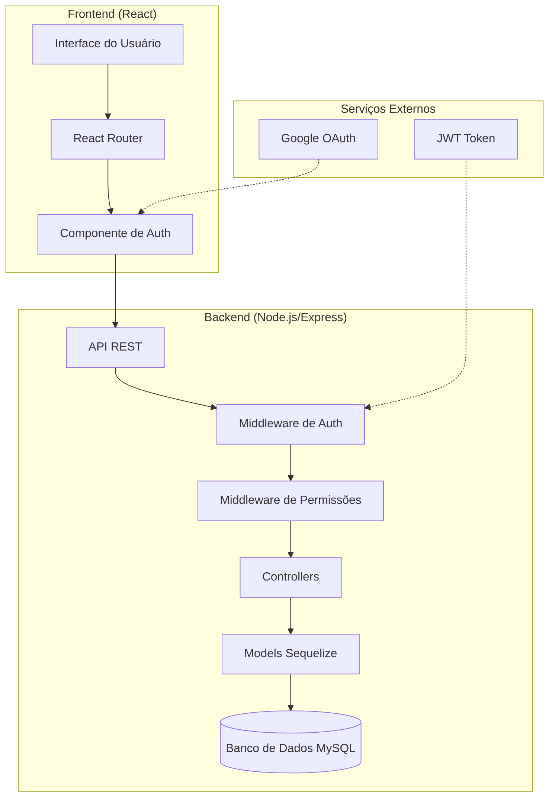
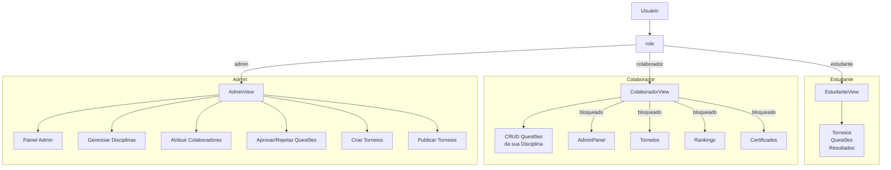

# Design Document: Colaborador (Professor) - Gestão de Questões

## Overview

Este documento detalha o design para a implementação do perfil "Colaborador" (também chamado de professor) no sistema COMAES. O colaborador é um terceiro papel de usuário, além de "estudante" e "admin", com acesso restrito exclusivamente à gestão de questões da disciplina a ele atribuída.

O sistema já possui a estrutura base implementada no modelo User.js com o campo `role` contendo o ENUM ('estudante', 'colaborador', 'admin') e o campo `disciplina_colaborador` para تحديد a disciplina do professor. Este design complementa e detalha a implementação completa da funcionalidade.

---

## Architecture

### Visão Geral do Sistema

O sistema utiliza uma arquitetura MVC (Model-View-Controller) com autenticação JWT. A adição do perfil colaborador requer ajustes na camada de autenticação, middleware de autorização, e novas rotas/controllers para gestão de questões.



### Arquitetura de Papéis



---

## Components and Interfaces

### Componente 1: AuthController

**Purpose**: Gerencia autenticação de usuários (login, registro, OAuth)

**Interface**:
```javascript
interface AuthController {
  register(req, res): Promise<Response>
  login(req, res): Promise<Response>
  googleOAuth(req, res): Promise<Response>
  logout(req, res): Promise<Response>
}
```

**Responsibilities**:
- Validar credenciais de usuário
- Gerar tokens JWT
- Associar usuário ao papel correto
- Suporte a login social (Google)

### Componente 2: QuestaoController

**Purpose**: Gerencia operações CRUD de questões

**Interface**:
```javascript
interface QuestaoController {
  // Colaborador - próprias questões
  createQuestao(req, res): Promise<Response>
  getMinhasQuestoes(req, res): Promise<Response>
  updateQuestao(req, res): Promise<Response>
  deleteQuestao(req, res): Promise<Response>
  
  // Admin - todas as questões
  getAllQuestoes(req, res): Promise<Response>
  approveQuestao(req, res): Promise<Response>
  rejectQuestao(req, res): Promise<Response>
  getPendingQuestoes(req, res): Promise<Response>
}
```

**Responsibilities**:
- Criar novas questões associadas ao autor
- Listar questões do colaborador logado
- Atualizar questões próprias (se não aprovadas)
- Excluir questões próprias
- Admin: aprovar/rejeitar questões pendentes

### Componente 3: DisciplinaController

**Purpose**: Gerencia disciplinas e atribuição de colaboradores

**Interface**:
```javascript
interface DisciplinaController {
  createDisciplina(req, res): Promise<Response>
  getAllDisciplinas(req, res): Promise<Response>
  assignColaborador(req, res): Promise<Response>
  getColaboradoresByDisciplina(req, res): Promise<Response>
}
```

**Responsibilities**:
- Criar novas disciplinas (apenas admin)
- Listar todas as disciplinas
- Atribuir colaboradores a disciplinas
- Listar colaboradores por disciplina

### Componente 4: TorneioController (Admin)

**Purpose**: Gerencia criação e publicação de torneios

**Interface**:
```javascript
interface TorneioController {
  createTorneio(req, res): Promise<Response>
  updateTorneio(req, res): Promise<Response>
  publishTorneio(req, res): Promise<Response>
  getTorneios(req, res): Promise<Response>
}
```

**Responsibilities**:
- Criar torneos baseados em questões de colaboradores
- Editar detalles do torneo
- Publicar/mudar status de rascunho para ativo
- Apenas admin pode publicar

---

## Data Models

### Model 1: Usuario (User)

```javascript
interface Usuario {
  id: Integer (PK, autoIncrement)
  nome: String(100) - NOT NULL
  telefone: String(20) - NOT NULL, UNIQUE
  email: String(100) - NOT NULL, UNIQUE
  nascimento: Date - NOT NULL
  sexo: Enum('Masculino', 'Feminino') - NOT NULL
  password: String(255) - NOT NULL
  escola: String(255) - NULL
  imagem: String(1024) - NULL
  biografia: Text - NULL
  role: Enum('estudante', 'colaborador', 'admin') - NOT NULL, default: 'estudante'
  disciplina_colaborador: Enum('matematica', 'ingles', 'programacao') - NULL
  isAdmin: Boolean - default: false
  createdAt: DateTime
  updatedAt: DateTime
}
```

**Validation Rules**:
- `nome`: Apenas letras e espaços, não pode ser apenas números
- `email`: Formato válido, bloqueia domínios incorretos (gmai, hotmal, etc.)
- `password`: Mínimo 8 caracteres, must have uppercase, lowercase, number, special char
- `disciplina_colaborador`: Apenas obrigatório quando role = 'colaborador'

### Model 2: Questao (Question)

```javascript
interface Questao {
  id: Integer (PK, autoIncrement)
  torneio_id: Integer (FK, nullable)
  titulo: String(255) - NOT NULL
  descricao: Text - NOT NULL
  disciplina: Enum('matematica', 'ingles', 'programacao') - NOT NULL
  tipo: Enum('multipla_escolha', 'texto', 'codigo') - NOT NULL
  dificuldade: Enum('facil', 'medio', 'dificil') - NOT NULL
  opcoes: JSON - NULL (para multipla_escolha)
  resposta_correta: Text - NOT NULL
  explicacao: Text - NULL
  pontos: Integer - default: 10
  linguagem: String(50) - NULL (para codigo)
  midia: JSON - NULL
  autor_id: Integer (FK to usuarios, nullable)
  status_aprovacao: Enum('pendente', 'aprovada', 'rejeitada') - default: 'aprovada'
  revisado_por: Integer (FK to usuarios, nullable)
  revisado_em: DateTime - NULL
  motivo_rejeicao: Text - NULL
  createdAt: DateTime
  updatedAt: DateTime
}
```

**Validation Rules**:
- `titulo`: Obrigatório, máximo 255 caracteres
- `descricao`: Obrigatório, texto da questão
- `disciplina`: Deve pertencer a uma disciplina válida
- `opcoes`: Obrigatório para tipo 'multipla_escolha', array de strings
- `resposta_correta`: Obrigatório
- `pontos`: Deve ser positivo

### Model 3: Disciplina (Discipline)

```javascript
interface Disciplina {
  id: Integer (PK, autoIncrement)
  nome: String(100) - NOT NULL, UNIQUE
  slug: String(50) - NOT NULL, UNIQUE
  descricao: Text - NULL
  cor: String(7) - NULL (hex color)
  ativo: Boolean - default: true
  createdAt: DateTime
  updatedAt: DateTime
}
```

---

## Algorithmic Pseudocode

### Algorithm 1: Autenticação e Autorização

```pascal
ALGORITHM authenticateUser
INPUT: credentials (email, password)
OUTPUT: result (token, user data) or error

BEGIN
  // Validar entrada
  IF NOT isValidEmail(credentials.email) THEN
    RETURN Error("Email inválido")
  END IF
  
  IF NOT isValidPassword(credentials.password) THEN
    RETURN Error("Senha inválida")
  END IF
  
  // Buscar usuário
  user ← database.usuarios.findByEmail(credentials.email)
  
  IF user IS NULL THEN
    RETURN Error("Usuário não encontrado")
  END IF
  
  // Verificar senha
  hash ← computeHash(credentials.password)
  
  IF hash NOT EQUALS user.password THEN
    RETURN Error("Senha incorreta")
  END IF
  
  // Gerar token JWT
  payload ← {
    id: user.id,
    email: user.email,
    role: user.role,
    disciplina_colaborador: user.disciplina_colaborador
  }
  
  token ← jwt.sign(payload, SECRET_KEY, { expiresIn: '24h' })
  
  RETURN Success({ token, user: sanitizeUser(user) })
END
```

**Preconditions**:
- credentials.email existe e é string não vazia
- credentials.password existe e é string não vazia

**Postconditions**:
- Se sucesso: retorna token JWT válido e dados do usuário sem password
- Se erro: retorna mensagem de erro específica

**Loop Invariants**: N/A

---

### Algorithm 2: Middleware de Verificação de Permissões

```pascal
ALGORITHM checkRolePermission
INPUT: user (from JWT), requiredRole
OUTPUT: boolean (permitted or not)

BEGIN
  // Verificar se usuário está autenticado
  IF user IS NULL THEN
    RETURN false
  END IF
  
  // Mapeamento de permissões
  permissions ← {
    'estudante': ['ver_torneios', 'participar_torneios', 'ver_ranking'],
    'colaborador': ['criar_questao', 'editar_questao', 'deletar_questao', 'ver_minhas_questoes'],
    'admin': ['*']
  }
  
  // Verificar permissão específica
  userPermissions ← permissions[user.role]
  
  IF userPermissions IS NULL THEN
    RETURN false
  END IF
  
  IF userPermissions INCLUDES '*' THEN
    RETURN true  // Admin tem todas as permissões
  END IF
  
  IF userPermissions INCLUDES requiredRole THEN
    RETURN true
  ELSE
    RETURN false
  END IF
END
```

**Preconditions**:
- user é objeto decodificado do JWT
- requiredRole é string não vazia

**Postconditions**:
- Retorna true se usuário tem permissão
- Retorna false se usuário não tem permissão

**Loop Invariants**: N/A

---

### Algorithm 3: CRUD de Questões por Colaborador

```pascal
ALGORITHM createQuestao
INPUT: questaoData, user (from JWT)
OUTPUT: created questao or error

BEGIN
  ASSERT user.role EQUALS 'colaborador'
  
  // Validar dados da questão
  IF NOT isValidQuestaoData(questaoData) THEN
    RETURN Error("Dados da questão inválidos")
  END IF
  
  // Verificar se disciplina corresponde ao colaborador
  IF questaoData.disciplina NOT EQUALS user.disciplina_colaborador THEN
    RETURN Error("Você só pode criar questões para sua disciplina")
  END IF
  
  // Criar questão com status pendente
  questao ← {
    titulo: questaoData.titulo,
    descricao: questaoData.descricao,
    disciplina: questaoData.disciplina,
    tipo: questaoData.tipo,
    dificuldade: questaoData.dificuldade,
    opcoes: questaoData.opcoes,
    resposta_correta: questaoData.resposta_correta,
    explicacao: questaoData.explicacao,
    pontos: questaoData.pontos,
    linguagem: questaoData.linguagem,
    midia: questaoData.midia,
    autor_id: user.id,
    status_aprovacao: 'pendente'  // Sempre começa pendente
  }
  
  savedQuestao ← database.questoes.create(questao)
  
  RETURN Success(savedQuestao)
END
```

**Preconditions**:
- user.role = 'colocolaborador'
- user.disciplina_colaborador está definido
- questaoData é objeto válido

**Postconditions**:
- Retorna questão criada com status 'pendente'
- Questão está associada ao autor (colaborador logado)

**Loop Invariants**: N/A

---

### Algorithm 4: Listar Questões do Colaborador

```pascal
ALGORITHM getMinhasQuestoes
INPUT: user (from JWT), filters (optional)
OUTPUT: lista de questões ou erro

BEGIN
  ASSERT user.role EQUALS 'colaborador'
  
  // Construir query com filtro por autor e disciplina
  query ← {
    autor_id: user.id
  }
  
  // Se filtro de disciplina fornecido, verificar se é a disciplina do colaborador
  IF filters.disciplina IS NOT NULL THEN
    IF filters.disciplina NOT EQUALS user.disciplina_colaborador THEN
      RETURN Error("Você só pode ver questões da sua disciplina")
    END IF
    query.disciplina ← filters.disciplina
  ELSE
    // Por padrão, mostrar apenas sua disciplina
    query.disciplina ← user.disciplina_colaborador
  END IF
  
  // Aplicar filtros opcionais
  IF filters.dificuldade IS NOT NULL THEN
    query.dificuldade ← filters.dificuldade
  END IF
  
  IF filters.status_aprovacao IS NOT NULL THEN
    query.status_aprovacao ← filters.status_aprovacao
  END IF
  
  // Buscar questões
  questoes ← database.questoes.findAll(query)
  
  RETURN Success(questoes)
END
```

**Preconditions**:
- user.role = 'colaborador'
- user.disciplina_colaborador está definido

**Postconditions**:
- Retorna apenas questões do colaborador logado
- Retorna apenas questões da disciplina do colaborador

**Loop Invariants**: N/A

---

### Algorithm 5: Aprovação de Questões pelo Admin

```pascal
ALGORITHM approveQuestao
INPUT: questaoId, adminUser (from JWT)
OUTPUT: updated questao ou erro

BEGIN
  ASSERT adminUser.role EQUALS 'admin'
  
  // Buscar questão
  questao ← database.questoes.findById(questaoId)
  
  IF questao IS NULL THEN
    RETURN Error("Questão não encontrada")
  END IF
  
  // Verificar se já está aprobada
  IF questao.status_aprovacao EQUALS 'aprovada' THEN
    RETURN Error("Questão já está aprovada")
  END IF
  
  // Atualizar status
  questao.status_aprovacao ← 'aprovada'
  questao.revisado_por ← adminUser.id
  questao.revisado_em ← NOW()
  
  updatedQuestao ← questao.save()
  
  RETURN Success(updatedQuestao)
END

ALGORITHM rejectQuestao
INPUT: questaoId, motivoRejeicao, adminUser (from JWT)
OUTPUT: updated questao ou erro

BEGIN
  ASSERT adminUser.role EQUALS 'admin'
  
  // Validar motivo
  IF motivoRejeicao IS NULL OR motivoRejeicao IS EMPTY THEN
    RETURN Error("Motivo da rejeição é obrigatório")
  END IF
  
  // Buscar questão
  questao ← database.questoes.findById(questaoId)
  
  IF questao IS NULL THEN
    RETURN Error("Questão não encontrada")
  END IF
  
  // Atualizar status
  questao.status_aprovacao ← 'rejeitada'
  questao.revisado_por ← adminUser.id
  questao.revisado_em ← NOW()
  questao.motivo_rejeicao ← motivoRejeicao
  
  updatedQuestao ← questao.save()
  
  RETURN Success(updatedQuestao)
END
```

**Preconditions**:
- adminUser.role = 'admin'
- questaoId é válido
- motivoRejeicao (para reject) não é vazio

**Postconditions**:
- Questão atualizada com status correto
- Campos revisado_por e revisado_em preenchidos

**Loop Invariants**: N/A

---

### Algorithm 6: Atribuição de Colaborador a Disciplina

```pascal
ALGORITHM assignColaboradorToDisciplina
INPUT: usuarioId, disciplina, adminUser (from JWT)
OUTPUT: updated user ou erro

BEGIN
  ASSERT adminUser.role EQUALS 'admin'
  
  // Validar disciplina
  validDisciplinas ← ['matematica', 'ingles', 'programacao']
  IF disciplina NOT IN validDisciplinas THEN
    RETURN Error("Disciplina inválida")
  END IF
  
  // Buscar usuário
  user ← database.usuarios.findById(usuarioId)
  
  IF user IS NULL THEN
    RETURN Error("Usuário não encontrado")
  END IF
  
  // Verificar se usuário existe e não é admin
  IF user.role EQUALS 'admin' THEN
    RETURN Error("Não é possível atribuir disciplina a admin")
  END IF
  
  // Atualizar usuário
  user.role ← 'colaborador'
  user.disciplina_colaborador ← disciplina
  
  updatedUser ← user.save()
  
  RETURN Success(updatedUser)
END
```

**Preconditions**:
- adminUser.role = 'admin'
- usuarioId é válido
- disciplina é uma das válidas

**Postconditions**:
- Usuário atualizado com role 'colaborador' e disciplina_colaborador

**Loop Invariants**: N/A

---

## Key Functions with Formal Specifications

### Function 1: authenticate()

```javascript
function authenticate(email, password)
```

**Preconditions**:
- `email` is non-null, valid email format
- `password` is non-null, minimum 8 characters

**Postconditions**:
- Returns JWT token if credentials are valid
- Returns error if user not found or password incorrect
- Token payload contains: id, email, role, disciplina_colaborador

**Loop Invariants**: N/A

---

### Function 2: createQuestao()

```javascript
function createQuestao(questaoData, user)
```

**Preconditions**:
- `user.role` equals 'colaborador'
- `user.disciplina_colaborador` is defined
- `questaoData.disciplina` equals `user.disciplina_colaborador`

**Postconditions**:
- Returns created questao with `status_aprovacao: 'pendente'`
- `questao.autor_id` equals `user.id`
- All required fields are populated

**Loop Invariants**: N/A

---

### Function 3: getMinhasQuestoes()

```javascript
function getMinhasQuestoes(user, filters)
```

**Preconditions**:
- `user.role` equals 'colaborador'
- `user.disciplina_colaborador` is defined

**Postconditions**:
- Returns only questions where `autor_id` equals `user.id`
- Returns only questions where `disciplina` equals `user.disciplina_colaborador`
- If filters provided, they are applied correctly

**Loop Invariants**: N/A

---

### Function 4: approveQuestao()

```javascript
function approveQuestao(questaoId, adminUser)
```

**Preconditions**:
- `adminUser.role` equals 'admin'
- `questaoId` corresponds to existing question

**Postconditions**:
- Returns question with `status_aprovacao: 'aprovada'`
- `revisado_por` equals `adminUser.id`
- `revisado_em` is timestamp of approval

**Loop Invariants**: N/A

---

### Function 5: assignColaborador()

```javascript
function assignColaborador(usuarioId, disciplina, adminUser)
```

**Preconditions**:
- `adminUser.role` equals 'admin'
- `disciplina` is in ['matematica', 'ingles', 'programacao']
- `usuarioId` corresponds to existing user

**Postconditions**:
- User has `role: 'colaborador'`
- User has `disciplina_colaborador` set to provided disciplina

**Loop Invariants**: N/A

---

## Example Usage

### Exemplo 1: Login de Colaborador

```pascal
SEQUENCE
  // Requisição POST /api/auth/login
  credentials ← {
    email: "professor@escola.com",
    password: "SenhaForte123!"
  }
  
  response ← authenticate(credentials)
  
  // Resposta bem-sucedida
  IF response.success THEN
    token ← response.token
    user ← response.user
    
    // Token contém:
    // {
    //   id: 5,
    //   email: "professor@escola.com",
    //   role: "colaborador",
    //   disciplina_colaborador: "matematica"
    // }
    
    STORE token IN localStorage
    REDIRECT TO "/colaborador/questoes"
  ELSE
    DISPLAY response.error
  END IF
END SEQUENCE
```

### Exemplo 2: Criar Questão (Colaborador)

```pascal
SEQUENCE
  // Requisição POST /api/questoes (com token JWT)
  questaoData ← {
    titulo: "Calcule o valor de x",
    descricao: "Se 2x + 5 = 15, qual é o valor de x?",
    disciplina: "matematica",
    tipo: "multipla_escolha",
    dificuldade: "facil",
    opcoes: ["5", "7", "10", "12"],
    resposta_correta: "5",
    explicacao: "2x + 5 = 15 → 2x = 10 → x = 5",
    pontos: 10
  }
  
  response ← createQuestao(questaoData, user)
  
  // Resposta
  IF response.success THEN
    questao ← response.data
    // status_aprovacao: "pendente"
    // mensagem: "Questão criada com sucesso e aguardando aprovação"
    DISPLAY "Questão criada! Aguarde aprovação do admin."
  ELSE
    DISPLAY response.error
  END IF
END SEQUENCE
```

### Exemplo 3: Listar Minhas Questões

```pascal
SEQUENCE
  // Requisição GET /api/questoes/minhas (com token JWT)
  
  response ← getMinhasQuestoes(user, { status_aprovacao: 'pendente' })
  
  IF response.success THEN
    questoes ← response.data
    
    FOR EACH questao IN questoes DO
      DISPLAY questao.titulo + " - " + questao.status_aprovacao
    END FOR
  ELSE
    DISPLAY response.error
  END IF
END SEQUENCE
```

### Exemplo 4: Aprovar Questão (Admin)

```pascal
SEQUENCE
  // Requisição PUT /api/questoes/123/aprovar (com token JWT admin)
  
  response ← approveQuestao(123, adminUser)
  
  IF response.success THEN
    questao ← response.data
    // status_aprovacao: "aprovada"
    // revisado_por: adminUser.id
    // revisado_em: timestamp atual
    DISPLAY "Questão aprovada com sucesso!"
  ELSE
    DISPLAY response.error
  END IF
END SEQUENCE
```

### Exemplo 5: Atribuir Colaborador (Admin)

```pascal
SEQUENCE
  // Requisição PUT /api/usuarios/5/atribuir-disciplina
  data ← {
    disciplina: "ingles"
  }
  
  response ← assignColaborador(5, data.disciplina, adminUser)
  
  IF response.success THEN
    user ← response.data
    // role: "colaborador"
    // disciplina_colaborador: "ingles"
    DISPLAY "Professor atribuído à disciplina de Inglês!"
  ELSE
    DISPLAY response.error
  END IF
END SEQUENCE
```

---

## Correctness Properties

*A property is a characteristic or behavior that should hold true across all valid executions of a system-essentially, a formal statement about what the system should do. Properties serve as the bridge between human-readable specifications and machine-verifiable correctness guarantees.*

### Property 1: Isolamento de Questões por Colaborador

*For any* collaborator, all questions returned by getMinhasQuestoes must belong to the collaborator's disciplina_colaborador.

**Validates: Requirements 2.2, 2.3, 3.1, 3.2, 3.3, 4.1, 4.2, 5.1, 5.2**

*For any* attempt to create a question with disciplina different from the collaborator's disciplina_colaborador, the system SHALL return an error.

**Validates: Requirements 2.2, 4.5**

### Property 2: Fluxo de Aprovação

*For any* question created by a collaborator, the status_aprovacao SHALL be 'pendente'.

**Validates: Requirements 2.1**

*For any* attempt to approve or reject a question by a non-admin user, the system SHALL return an error.

**Validates: Requirements 7.1, 7.2, 7.3, 7.4, 7.5, 7.6, 8.1, 8.3, 8.4, 8.5, 8.6**

### Property 3: Restrições de Acesso por Papel

*For any* request to admin routes by a user with role 'colaborador', the system SHALL return HTTP 403 Forbidden.

**Validates: Requirements 14.2, 14.4**

*For any* request to admin routes by a user with role 'estudante', the system SHALL return HTTP 403 Forbidden.

**Validates: Requirements 14.1, 14.3, 14.4, 14.5**

*For any* attempt to create a question by a user with role 'estudante', the system SHALL return an error.

**Validates: Requirements 14.5**

### Property 4: Integridade de Dados

*For any* question with status_aprovacao 'pendente', the revisado_por and revisado_em fields SHALL be NULL.

**Validates: Requirements 15.1, 15.2**

*For any* question with status_aprovacao 'aprovada' or 'rejeitada', the revisado_por and revisado_em fields SHALL NOT be NULL.

**Validates: Requirements 15.3, 15.4**

*For any* question with status_aprovacao 'rejeitada', the motivo_rejeicao field SHALL NOT be NULL.

**Validates: Requirements 15.5**

### Property 5: JWT Token Security

*For any* valid authentication, the returned JWT token SHALL contain id, email, role, and disciplina_colaborador in the payload.

**Validates: Requirements 1.5**

*For any* authentication response, the password field SHALL NOT be included.

**Validates: Requirements 1.6**

*For any* JWT token generated, the expiration SHALL be set to 24 hours.

**Validates: Requirements 16.1**

### Property 6: Regression - Existing Functionality

*For any* existing student user, the authentication flow SHALL remain unchanged.

**Validates: Requirements 17.1**

*For any* access to GET /api/torneios, the system SHALL allow access without authentication.

**Validates: Requirements 17.3**

*For any* admin user, the existing TorneioController create and update operations SHALL continue to work as before.

**Validates: Requirements 18.1, 18.2, 18.3, 18.4**

---

## Error Handling

### Error Scenario 1: Tentativa de criar questão de outra disciplina

**Condition**: Colaborador tenta criar questão com disciplina diferente da sua
**Response**: HTTP 403 Forbidden com mensagem explicativa
**Recovery**: Usuário deve selecionar sua própria disciplina

### Error Scenario 2: Questão não encontrada

**Condition**: ID de questão inexistente fornecido
**Response**: HTTP 404 Not Found
**Recovery**: Verificar ID fornecido ou listar questões disponíveis

### Error Scenario 3: Questão já aprovada

**Condition**: Admin tenta aprovar questão já aprovada
**Response**: HTTP 400 Bad Request "Questão já está aprovada"
**Recovery**: N/A - questão já disponível no banco

### Error Scenario 4: Acesso não autorizado

**Condition**: Usuário sem permissão tenta acessar recurso
**Response**: HTTP 403 Forbidden com mensagem "Acesso negado"
**Recovery**: Verificar role do usuário ou fazer login correto

### Error Scenario 5: Token JWT expirado/inválido

**Condition**: Token não fornecido ou inválido
**Response**: HTTP 401 Unauthorized
**Recovery**: Fazer login novamente para obter novo token

### Error Scenario 6: Rejeição sem motivo

**Condition**: Admin tenta rejeitar questão sem fornecer motivo
**Response**: HTTP 400 Bad Request "Motivo da rejeição é obrigatório"
**Recovery**: Fornecer descrição do motivo da rejeição

---

## Testing Strategy

### Unit Testing Approach

**Key Test Cases**:
1. **authenticate()**: Validar login com credenciais corretas e incorretas
2. **createQuestao()**: Testar criação com dados válidos e inválidos
3. **getMinhasQuestoes()**: Verificar filtro por disciplina do colaborador
4. **approveQuestao()**: Testar aprovação por admin e rejeição por colaborador
5. **assignColaborador()**: Testar atribuição de disciplina a usuário

**Coverage Goals**:
- Mínimo 80% de cobertura nas funções de controller
- Todos os casos de erro devem ter teste

### Property-Based Testing Approach

**Library**: fast-check (for JavaScript/TypeScript)

**Properties to Test**:
- **Propriedade 1**: `getMinhasQuestoes` sempre retorna apenas questões da disciplina do colaborador (gera questões aleatórias e verifica)
- **Propriedade 2**: Questões criadas por colaboradores sempre começam com `status_aprovacao: 'pendente'`
- **Propriedade 3**: Usuários com role 'colaborador' não conseguem acessar rotas de admin

### Integration Testing Approach

**Testes End-to-End**:
1. **Fluxo Colaborador**: Login → Criar Questão → Verificar Status Pendente
2. **Fluxo Admin**: Login Admin → Ver Questões Pendentes → Aprovar → Verificar Status
3. **Fluxo Atribuição**: Login Admin → Atribuir Disciplina → Login Colaborador → Verificar Acesso

---

## Performance Considerations

- **Índices no Banco**: Adicionar índice composto em `questoes(autor_id, disciplina, status_aprovacao)` para queries frequentes
- **Paginação**: Implementar paginação em `getMinhasQuestoes()` para evitar retorno de muitas questões
- **Cache**: Considerar cache de disciplinas (pouco mutável)
- **Limit Rate**: Implementar rate limiting em rotas de criação de questões

---

## Security Considerations

### Authentication & Authorization
- Tokens JWT com expiração de 24h
- Refresh tokens para renovação automática
- HTTPS obrigatório em produção

### Role-Based Access Control (RBAC)
- Middleware `checkRolePermission` para todas as rotas protegidas
- Validação de permissão no nível do controller E middleware

### Input Validation
- Sanitização de entrada em todos os campos
- Validação de tipo e formato (email, enum values)
- Limite de tamanho em campos de texto

### Data Protection
- Senhas hasheadas com bcrypt
- Dados sensíveis nunca expostos em responses
- Campos como `password` sempre excluídos do response

---

## Dependencies

### Backend (Node.js)
- **express**: Web framework
- **sequelize**: ORM para MySQL
- **jsonwebtoken**: JWT authentication
- **bcrypt**: Password hashing
- **joi** ou **zod**: Input validation

### Frontend (React)
- **react-router-dom**: Routing
- **axios**: HTTP client
- **jwt-decode**: Token parsing

### Database
- **MySQL**: Banco de dados relacional

---

## Routes Summary

| Método | Rota | Acesso | Descrição |
|--------|------|--------|-----------|
| POST | /api/auth/login | Público | Login de usuário |
| POST | /api/auth/register | Público | Registro de usuário |
| GET | /api/questoes/minhas | Colaborador | Listar minhas questões |
| POST | /api/questoes | Colaborador | Criar questão |
| PUT | /api/questoes/:id | Colaborador | Atualizar questão (própria) |
| DELETE | /api/questoes/:id | Colaborador | Deletar questão (própria) |
| GET | /api/questoes/pendentes | Admin | Listar pendentes |
| PUT | /api/questoes/:id/aprovar | Admin | Aprovar questão |
| PUT | /api/questoes/:id/rejeitar | Admin | Rejeitar questão |
| GET | /api/disciplinas | Admin | Listar disciplinas |
| POST | /api/disciplinas | Admin | Criar disciplina |
| PUT | /api/usuarios/:id/atribuir | Admin | Atribuir colaborador a disciplina |
| GET | /api/torneios | Público | Listar torneios |
| POST | /api/torneios | Admin | Criar torneio |
| PUT | /api/torneios/:id/publicar | Admin | Publicar torneio |