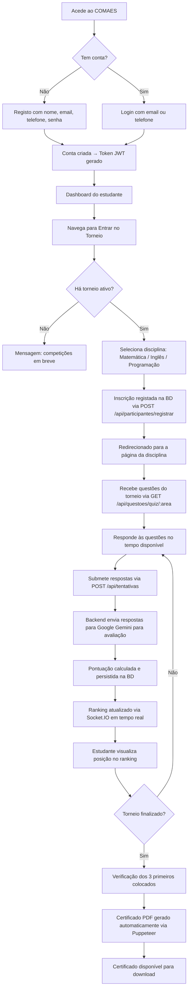
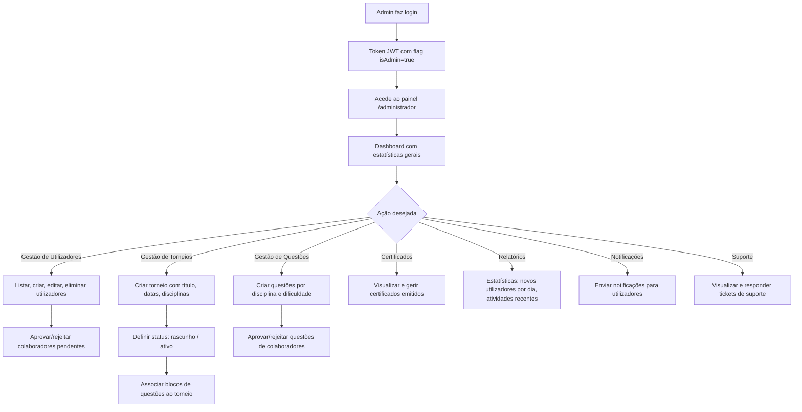
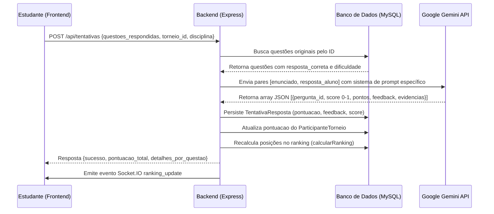
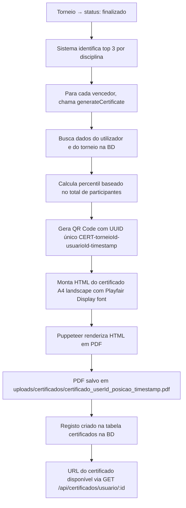
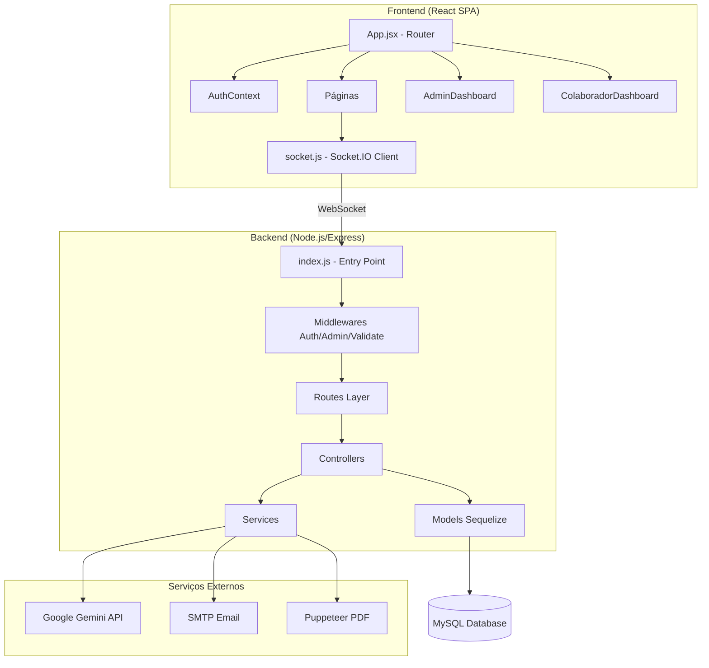
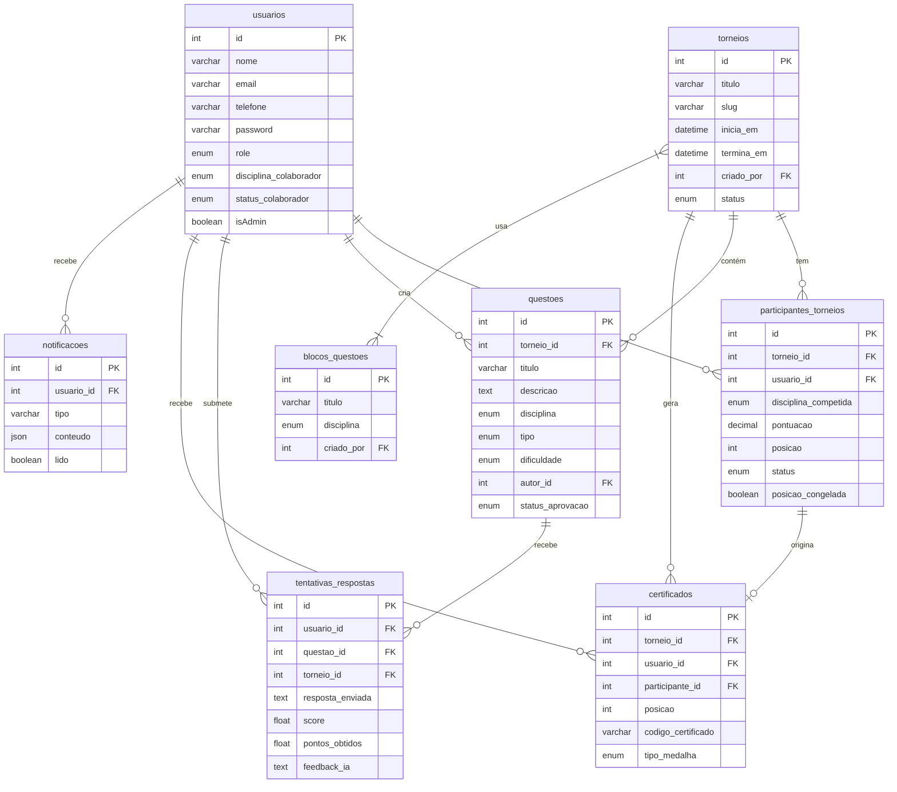

# DOCUMENTAÇÃO TÉCNICA COMPLETA — COMAES
## Plataforma de Competições Académicas e Educacionais

> **Versão do Documento:** 3.2  
> **Data de Elaboração:** Junho de 2026  
> **Finalidade:** Trabalho de Conclusão de Curso (TCC) — Documentação Técnica Completa  
> **Nível de Detalhamento:** Académico e Profissional

---

## ÍNDICE GERAL

1. [Apresentação do Projeto](#1-apresentação-do-projeto)
2. [Visão Geral da Solução](#2-visão-geral-da-solução)
3. [Tecnologias Utilizadas](#3-tecnologias-utilizadas)
4. [Arquitetura de Software](#4-arquitetura-de-software)
5. [Estrutura de Pastas](#5-estrutura-de-pastas)
6. [Análise Completa dos Arquivos](#6-análise-completa-dos-arquivos)
7. [Banco de Dados](#7-banco-de-dados)
8. [Modelagem dos Dados](#8-modelagem-dos-dados)
9. [Sistema de Autenticação](#9-sistema-de-autenticação)
10. [APIs e Serviços](#10-apis-e-serviços)
11. [Módulos Funcionais](#11-módulos-funcionais)
12. [Regras de Negócio](#12-regras-de-negócio)
13. [Segurança](#13-segurança)
14. [Experiência do Utilizador](#14-experiência-do-utilizador)
15. [Fluxo Completo do Sistema](#15-fluxo-completo-do-sistema)
16. [Algoritmos Importantes](#16-algoritmos-importantes)
17. [Dependências do Projeto](#17-dependências-do-projeto)
18. [Processo de Instalação](#18-processo-de-instalação)
19. [Processo de Deploy](#19-processo-de-deploy)
20. [Conclusão Técnica](#20-conclusão-técnica)

---


## 1. APRESENTAÇÃO DO PROJETO

### 1.1 Nome do Projeto

**COMAES** — Plataforma de Competições Académicas e Educacionais  
*(Versão 3.2, em desenvolvimento contínuo desde 2026)*

### 1.2 Finalidade

O COMAES é uma plataforma digital educacional concebida para organizar, gerir e conduzir competições académicas entre estudantes do ensino secundário e superior em Angola. A plataforma serve como ambiente centralizado onde administradores publicam torneios nas disciplinas de Matemática, Inglês e Programação; colaboradores (docentes ou especialistas) contribuem com questões académicas; e estudantes participam nas competições, recebendo pontuação automática e certificados digitais.

### 1.3 Problema que Resolve

Em Angola, a realização de olimpíadas e competições académicas enfrenta obstáculos logísticos consideráveis: coordenação manual entre escolas, dificuldade na elaboração e distribuição de provas, ausência de ferramentas de avaliação automatizada, e ineficiência na geração e distribuição de resultados e certificados. O COMAES resolve estes problemas ao digitalizar integralmente o ciclo competitivo — da inscrição ao certificado —, permitindo que a competição ocorra de forma assíncrona e escalável através da internet.

### 1.4 Público-Alvo

- **Estudantes** do ensino médio e superior que desejam medir o seu conhecimento nas áreas de Matemática, Inglês e Programação.
- **Docentes e especialistas** (denominados "Colaboradores") que contribuem com a criação e revisão de questões académicas.
- **Administradores** da plataforma (coordenadores pedagógicos ou funcionários da organização promotora) responsáveis pela gestão de torneios, utilizadores e conteúdos.

### 1.5 Objetivos Gerais

Desenvolver uma plataforma web completa, segura e escalável que automatize o processo de competições académicas, integrando tecnologias modernas de desenvolvimento web, banco de dados relacional e inteligência artificial para avaliação de respostas abertas.

### 1.6 Objetivos Específicos

1. Implementar um sistema robusto de autenticação e controlo de acesso baseado em papéis (RBAC).
2. Desenvolver um módulo de gestão de torneios com ciclo de vida completo (rascunho → ativo → encerrando → finalizado).
3. Criar um sistema de questões multi-disciplinar com suporte a múltipla escolha, texto aberto e código.
4. Integrar a API do Google Gemini para avaliação automatizada de respostas abertas em Matemática, Inglês e Programação.
5. Implementar um sistema de ranking em tempo real utilizando WebSockets (Socket.IO).
6. Automatizar a geração de certificados digitais em PDF com QR Code de verificação.
7. Desenvolver um painel administrativo completo para gestão de utilizadores, conteúdos e estatísticas.
8. Construir um sistema de notificações em tempo real e de suporte ao utilizador.

### 1.7 Benefícios Esperados

- **Acessibilidade:** Qualquer estudante com acesso à internet pode participar, independentemente da sua localização geográfica.
- **Transparência:** O ranking é público e atualizado em tempo real, garantindo credibilidade nos resultados.
- **Eficiência:** O processo que anteriormente demandava dias de trabalho manual é concluído em minutos de forma automatizada.
- **Qualidade:** A avaliação por IA garante consistência e imparcialidade na correção de respostas subjetivas.
- **Reconhecimento:** Certificados digitais com código de verificação fornecem credencial formal aos participantes.

### 1.8 Diferenciais da Solução

- **Avaliação por Inteligência Artificial:** Uso do modelo Google Gemini 2.5 Flash para correção automatizada de respostas abertas de Matemática, Inglês e Programação — eliminando a necessidade de correção humana para respostas dissertativas.
- **Tempo Real:** Ranking e notificações são atualizados em tempo real através de Socket.IO, proporcionando experiência dinâmica durante as competições.
- **Sistema de Blocos de Questões:** Questões são organizadas em blocos temáticos que podem ser associados a torneios, permitindo reutilização e organização pedagógica.
- **Ciclo de Aprovação de Questões:** Questões criadas por colaboradores passam por revisão administrativa antes de entrar em produção, garantindo qualidade do conteúdo.
- **Certificados com QR Code:** Os certificados gerados contêm código de verificação e QR Code que permite validação da autenticidade online.

---


## 2. VISÃO GERAL DA SOLUÇÃO

### 2.1 Como o Sistema Funciona

O COMAES é uma aplicação web de arquitetura cliente-servidor (SPA + REST API), composta por:

- Um **frontend** em React.js (SPA — Single Page Application) que comunica com o backend via HTTP/REST e WebSocket.
- Um **backend** em Node.js/Express.js que expõe uma API RESTful e um servidor WebSocket (Socket.IO).
- Um **banco de dados** MySQL gerido pelo ORM Sequelize.
- Integração com a **API Google Gemini** para avaliação de respostas abertas.
- Serviço de **email SMTP** (Nodemailer) para recuperação de senha e notificações.
- Geração de **PDFs** via Puppeteer (Chrome headless) para emissão de certificados.

### 2.2 Fluxo Completo do Utilizador (Estudante)



### 2.3 Fluxo Completo do Administrador



### 2.4 Fluxo Completo das Competições

```mermaid
flowchart LR
    A[Admin cria torneio - status: rascunho] --> B[Admin configura datas de início e fim]
    B --> C[Admin associa blocos de questões]
    C --> D[Admin muda status para ativo]
    D --> E[Torneio visível e acessível aos estudantes]
    E --> F[Estudantes inscrevem-se nas disciplinas]
    F --> G[Estudantes respondem às questões]
    G --> H[Respostas avaliadas por IA Gemini]
    H --> I[Pontuações atualizadas em tempo real]
    I --> J[Data de fim alcançada → cron job muda para encerrando]
    J --> K[24h depois → cron job muda para finalizado]
    K --> L[Certificados gerados para top 3 de cada disciplina]
```



### 2.5 Fluxo Completo das Avaliações



### 2.6 Fluxo Completo dos Rankings

O ranking é calculado em tempo real sempre que um estudante submete respostas. O algoritmo `calcularRanking` do modelo `ParticipanteTorneio` ordena os participantes por pontuação decrescente e desempata pelo momento de inscrição (quem inscreveu primeiro tem prioridade). As posições são persistidas na base de dados. Quando o torneio finaliza, as posições são "congeladas" (campo `posicao_congelada = true`) para garantir imutabilidade do resultado final. O frontend recebe atualizações via Socket.IO e também faz polling automático a cada 15 segundos como fallback.

### 2.7 Fluxo Completo da Geração de Resultados e Certificados



---


## 3. TECNOLOGIAS UTILIZADAS

### 3.1 Frontend

#### Framework Principal
- **React.js 18.3.1** — Biblioteca JavaScript para construção de interfaces de utilizador baseadas em componentes. Utilizada como SPA (Single Page Application) com React Router DOM 7.9.6 para navegação client-side sem recarregamento de página.

#### Bibliotecas de UI e Estilização
| Biblioteca | Versão | Finalidade |
|-----------|--------|-----------|
| **Tailwind CSS** | 3.4.18 | Framework CSS utility-first para estilização rápida e responsiva de componentes |
| **Bootstrap** | 5.3.8 | Framework CSS adicional para componentes de formulários e layouts |
| **React Bootstrap** | 2.10.10 | Wrappers React para componentes Bootstrap |
| **Framer Motion** | 12.38.0 | Biblioteca de animações para transições de página e animações de componentes |
| **Lucide React** | 0.562.0 | Biblioteca de ícones SVG modernos e acessíveis |
| **React Icons** | 5.5.0 | Conjunto amplo de ícones (FontAwesome, Material, Bootstrap, etc.) |

#### Bibliotecas de Dados e Gráficos
| Biblioteca | Versão | Finalidade |
|-----------|--------|-----------|
| **Axios** | 1.13.2 | Cliente HTTP para requisições à API REST do backend |
| **Recharts** | 3.6.0 | Biblioteca de gráficos baseada em D3.js para visualizações no painel admin |
| **React Circular Progressbar** | 2.2.0 | Componente de barra de progresso circular para estatísticas |

#### Comunicação em Tempo Real
- **Socket.IO Client** 4.7.1 — Biblioteca para comunicação bidirecional em tempo real com o servidor via WebSocket, usada para atualizações de ranking, notificações e estatísticas ao vivo.

#### Roteamento e Contexto
- **React Router DOM** 7.9.6 — Gerenciamento de rotas SPA com suporte a rotas protegidas (ProtectedRoute) por papel de utilizador.
- **React Context API** (nativo) — Gestão de estado global de autenticação através do `AuthContext`.

#### Ferramentas de Build
| Ferramenta | Versão | Finalidade |
|-----------|--------|-----------|
| **Vite** | 5.4.1 | Bundler e servidor de desenvolvimento ultrarrápido com HMR |
| **@vitejs/plugin-react** | 4.3.1 | Plugin Vite para suporte a React (JSX, Fast Refresh) |
| **PostCSS** | 8.5.6 | Processador de CSS para compatibilidade com Tailwind |
| **Autoprefixer** | 10.4.22 | Plugin PostCSS para adicionar prefixos de vendor automaticamente |
| **ESLint** | 9.9.0 | Linter para detecção de erros e padrões de código |

---

### 3.2 Backend

#### Framework Principal
- **Node.js** (versão não especificada, compatível com ESM) — Runtime JavaScript server-side com suporte a módulos ES nativos (`"type": "module"` no package.json).
- **Express.js 5.2.1** — Framework web minimalista para construção da API REST. A versão 5 traz melhorias de tratamento assíncrono nativo.

#### Bibliotecas de Autenticação e Segurança
| Biblioteca | Versão | Finalidade |
|-----------|--------|-----------|
| **jsonwebtoken** | 9.0.0 | Geração e verificação de tokens JWT (JSON Web Token) para autenticação stateless |
| **bcryptjs** | 2.4.3 | Hashing seguro de senhas com algoritmo bcrypt (salt rounds: 10) |

#### Banco de Dados e ORM
| Biblioteca | Versão | Finalidade |
|-----------|--------|-----------|
| **Sequelize** | 6.37.7 | ORM (Object-Relational Mapper) para abstração do banco de dados MySQL |
| **mysql2** | 3.16.0 | Driver MySQL de alta performance para Node.js, utilizado pelo Sequelize |
| **sequelize-cli** | 6.6.5 | Ferramenta de linha de comando para gestão de migrations e seeds |

#### Comunicação e Serviços
| Biblioteca | Versão | Finalidade |
|-----------|--------|-----------|
| **Socket.IO** | 4.7.1 | Servidor WebSocket para comunicação bidirecional em tempo real |
| **nodemailer** | 8.0.5 | Envio de emails via SMTP (recuperação de senha, boas-vindas) |
| **cors** | 2.8.5 | Middleware para configuração de Cross-Origin Resource Sharing |
| **dotenv** | 17.2.3 | Carregamento de variáveis de ambiente a partir do ficheiro `.env` |
| **multer** | 1.4.5-lts.1 | Middleware para upload de ficheiros multipart/form-data |

#### Inteligência Artificial
- **@google/generative-ai** 0.11.0 — SDK oficial do Google para acesso à API Gemini. Utilizado para avaliação automatizada de respostas abertas nas disciplinas de Matemática, Inglês e Programação.

#### Geração de PDFs e QR Codes
| Biblioteca | Versão | Finalidade |
|-----------|--------|-----------|
| **puppeteer** | 24.40.0 | Controlo de navegador Chrome headless para renderizar HTML e exportar em PDF |
| **qrcode** | 1.5.4 | Geração de QR Codes em formato base64 para incorporação nos certificados |
| **uuid** | 13.0.0 | Geração de identificadores únicos universais para códigos de certificados |

#### Utilitários
| Biblioteca | Versão | Finalidade |
|-----------|--------|-----------|
| **nodemon** | 3.1.11 | Monitor de alterações de ficheiros para reinício automático em desenvolvimento |
| **node-fetch** | 3.3.1 | Implementação do Fetch API para Node.js (requisições HTTP do servidor) |

---

### 3.3 Banco de Dados

- **SGBD:** MariaDB 10.4.32 / MySQL 8.0 (compatíveis) com charset utf8mb4 e collation utf8mb4_unicode_ci
- **ORM:** Sequelize 6.37.7 com suporte a migrations (`sequelize-cli`)
- **Nome do banco:** `comaes_db`
- **Conexão:** Pool de conexões com máximo de 5 conexões simultâneas, timeout de 30 segundos

### 3.4 Inteligência Artificial

#### Integração
A plataforma integra o **Google Gemini 2.5 Flash** (`gemini-2.5-flash`) através da biblioteca `@google/generative-ai`. A integração ocorre exclusivamente no backend (`BackEnd/services/iaEvaluators.js`) e é acionada durante a submissão de respostas de um torneio.

#### Modelos Utilizados
- **Modelo:** `gemini-2.5-flash` — Modelo multimodal de alta velocidade da Google, escolhido por equilibrar qualidade de avaliação e velocidade de resposta.
- **Temperatura:** `0` — Configuração determinística para garantir consistência nas avaliações (sem aleatoriedade).
- **Max Output Tokens:** `2048` — Suficiente para retornar avaliações detalhadas em formato JSON.

#### Funcionamento da IA no Sistema

Para cada disciplina, é construído um **System Prompt** especializado:

- **Matemática:** Avalia clareza do raciocínio matemático e coerência dos passos. Pontuação: fácil (0-5pts), médio (0-10pts), difícil (0-20pts).
- **Programação:** Avalia lógica do algoritmo, ausência de hard-coding e clareza do código. Mesma escala de pontuação.
- **Inglês:** Avalia coesão textual, gramática e adequação ao enunciado. Mesma escala de pontuação.

A IA retorna um array JSON com `pergunta_id`, `score` (0.0 a 1.0), `pontos`, `feedback` e `evidencias` para cada resposta avaliada. O backend processa este JSON, persiste os resultados na tabela `tentativas_respostas` e atualiza a pontuação do participante no torneio.

---


## 4. ARQUITETURA DE SOFTWARE

### 4.1 Arquitetura Adotada

O COMAES adota a **Arquitetura em Camadas (N-Tier Architecture)** combinada com o padrão **MVC (Model-View-Controller)** no backend e **Component-Based Architecture** no frontend.

```
┌─────────────────────────────────────────────────────────┐
│              CAMADA DE APRESENTAÇÃO (FrontEnd)           │
│         React.js SPA — Vite 5 — Tailwind CSS            │
│    Componentes, Páginas, Contexto, Hooks, Serviços       │
└────────────────────────────┬────────────────────────────┘
                             │ HTTP REST + WebSocket
                             ▼
┌─────────────────────────────────────────────────────────┐
│              CAMADA DE APLICAÇÃO (BackEnd)               │
│              Node.js + Express.js 5                      │
│  Rotas → Middlewares → Controllers → Services → Models   │
└────────────────────────────┬────────────────────────────┘
                             │ Sequelize ORM
                             ▼
┌─────────────────────────────────────────────────────────┐
│              CAMADA DE DADOS (Database)                  │
│         MySQL / MariaDB — charset utf8mb4                │
│    Tabelas, Relacionamentos, Índices, Constraints        │
└─────────────────────────────────────────────────────────┘
                             │
                             ▼
┌─────────────────────────────────────────────────────────┐
│              SERVIÇOS EXTERNOS                           │
│  Google Gemini API │ SMTP Email │ Puppeteer PDF          │
└─────────────────────────────────────────────────────────┘
```

### 4.2 Camadas do Sistema

#### Camada de Apresentação (Frontend — `/FrontEnd`)
Responsável pela interface do utilizador. Composta por:
- **Páginas (Pages/Paginas):** Componentes React de nível de rota
- **Componentes reutilizáveis (components):** Modais, cards, formulários
- **Contexto (context):** Estado global de autenticação via React Context API
- **Hooks:** Lógica de estado reutilizável (useCertificado, useQuiz, useTorneioParticipante)
- **Serviços (services):** Funções de comunicação com a API REST
- **Utilitários (utils):** Funções de validação e formatação

#### Camada de Aplicação (Backend — `/BackEnd`)
Responsável pela lógica de negócio e exposição da API. Composta por:
- **Ponto de entrada (index.js):** Configuração do servidor, middlewares globais, rotas inline de autenticação
- **Rotas (routes):** Definição de endpoints e associação com middlewares e controllers
- **Middlewares:** Autenticação JWT, verificação de permissões, validação de entrada, sanitização
- **Controllers:** Implementação dos handlers HTTP por domínio de negócio
- **Models:** Definições de entidades Sequelize com validações e associações
- **Services:** Lógica de negócio complexa (email, socket, IA, cron, torneio)
- **Utils:** Funções auxiliares (validadores, mapeador de modelos)

#### Camada de Dados (Database)
MySQL/MariaDB com schema gerido por migrations Sequelize. 18 tabelas relacionais.

### 4.3 Padrões de Projeto Identificados

| Padrão | Localização | Descrição |
|--------|-------------|-----------|
| **MVC** | Backend inteiro | Models Sequelize, Controllers, Routes como View-layer |
| **Repository Pattern** | Models Sequelize | Abstração de acesso a dados via ORM |
| **Singleton** | `socketService.js`, `db.js` | Instâncias únicas de Socket.IO e Sequelize |
| **Factory** | `validate.js` middleware | Fábrica de middlewares de validação por regra |
| **Observer** | Socket.IO events | Padrão de eventos para atualizações em tempo real |
| **Strategy** | `iaEvaluators.js` | Estratégias de avaliação diferentes por disciplina |
| **Context/Provider** | `AuthContext.jsx` | Estado global de autenticação via React Context |
| **Protected Route** | `ProtectedAdminRoute.jsx` | Guarda de rotas por papel de utilizador |
| **RBAC** | Middlewares `isAdmin`, `canManageQuestoes` | Controlo de acesso baseado em papéis |
| **Cron Job** | `torneioCron.js` | Processamento automático de transições de estado |

### 4.4 Diagrama de Componentes



### 4.5 Estratégias de Segurança

1. **Autenticação JWT stateless:** Tokens com expiração de 7 dias, assinados com `JWT_SECRET` configurável.
2. **Hashing de senhas:** bcrypt com 10 salt rounds, protegendo contra ataques de força bruta mesmo em caso de vazamento da base de dados.
3. **RBAC:** Três papéis distintos (estudante, colaborador, admin) com middlewares específicos.
4. **Sanitização de entrada:** Middleware `baseSanitizer` remove chaves de injeção NoSQL; middleware `validate.js` aplica regras de validação com regex.
5. **Prevenção de injeção SQL:** Sequelize ORM usa parametrização automática; queries diretas usam `replacements` parametrizados.
6. **Prevenção de Race Conditions:** Transações com lock pessimista (`LOCK.UPDATE`) na inscrição de participantes.
7. **Upload seguro:** Middleware `uploadValidator.js` verifica tipo MIME e tamanho máximo (5MB) de ficheiros enviados.
8. **Proteção CORS:** Configurada para aceitar origens da rede local com credenciais.

---


## 5. ESTRUTURA DE PASTAS

### 5.1 Estrutura Raiz do Projeto

```
COMAES-3.2/
├── BackEnd/                  # Servidor Node.js/Express
├── FrontEnd/                 # Aplicação React
├── .kiro/                    # Configurações do ambiente de desenvolvimento Kiro
├── .vite/                    # Cache de dependências do Vite
├── .gitignore                # Ficheiros ignorados pelo Git
├── package.json              # Dependências da raiz (Tailwind, PostCSS, Vite)
├── vite.config.js            # Configuração do bundler Vite (raiz)
├── tailwind.config.js        # Configuração do Tailwind CSS
├── postcss.config.js         # Configuração do PostCSS
├── eslint.config.js          # Configuração do ESLint
├── index.html                # HTML de entrada da SPA
└── [Vários arquivos .md]     # Documentação técnica gerada durante o desenvolvimento
```

### 5.2 Estrutura do Backend

```
BackEnd/
├── certificates/
│   └── generator/
│       ├── generateCertificado.js    # Motor de geração de certificados PDF
│       └── index.js                  # Exportações do módulo
├── config/
│   ├── db.js                         # Configuração e conexão Sequelize
│   └── sequelize.config.json         # Configuração CLI do Sequelize
├── controllers/
│   ├── adminStatsController.js       # Estatísticas do painel admin
│   ├── BlocosController.js           # CRUD de blocos de questões
│   ├── ColaboradorController.js      # Painel do colaborador
│   ├── GenericController.js          # CRUD genérico para o painel admin
│   ├── QuestoesController.js         # Controller legado de questões (descontinuado)
│   ├── QuestoesControllerRefactored.js # Controller atual de questões
│   ├── TentativasController.js       # Submissão e avaliação de respostas
│   ├── TesteConhecimentoController.js # Teste de conhecimento independente
│   ├── TorneioController.js          # CRUD de torneios e participantes
│   ├── TorneoController.js           # Alias/versão anterior do TorneioController
│   └── UserController.js             # CRUD de utilizadores e aprovação de colaboradores
├── hooks.js/
│   └── useTorneio.js                 # Hook (localizado indevidamente no backend)
├── middlewares/
│   ├── auth.js                       # Verificação de token JWT
│   ├── canManageQuestoes.js          # Verifica se pode gerir questões (admin ou colaborador)
│   ├── isAdmin.js                    # Verifica se é administrador
│   ├── isNotColaborador.js           # Bloqueia acesso a colaboradores
│   ├── validate.js                   # Middleware de validação de entrada
│   └── security/
│       ├── sanitizer.js              # Sanitização contra NoSQL injection
│       └── uploadValidator.js        # Validação de uploads de ficheiros
├── migrations/                       # Scripts de migração da BD (Sequelize CLI)
│   ├── 20260408000101-alter-fk-not-null.cjs
│   ├── 20260416000000-create-certificados-table.cjs
│   ├── 20260422000000-add-slug-to-torneios.cjs
│   ├── 20260515000000-fix-position-defaults.cjs
│   ├── 20260515000001-add-ranking-persistence.cjs
│   ├── 20260522000000-create-tentativas-respostas-table.cjs
│   ├── 20260522000002-create-questoes-table.cjs
│   ├── 20260522000003-disable-legacy-tables.cjs
│   ├── 20260523000000-fix-questoes-cascade.cjs
│   ├── 20260524000000-create-questoes-teste-conhecimento.cjs
│   ├── 20260526000000-create-resultados-teste-table.cjs
│   ├── 20260528000000-add-visualizacoes-to-noticias.cjs
│   ├── 20260601000000-add-colaborador-role-and-question-review.cjs
│   ├── 20260601100000-create-blocos-questoes.cjs
│   └── 20260602000000-add-status-colaborador.cjs
├── models/
│   ├── associations.js               # Configuração centralizada de todas as associações
│   ├── BlocoQuestaoItem.js           # Modelo da tabela de junção bloco↔questão
│   ├── BlocoQuestoes.js              # Modelo de blocos de questões
│   ├── Certificado.js                # Modelo de certificados (novo sistema)
│   ├── Certificate.js                # Modelo de certificados (sistema legado)
│   ├── ConfiguracaoUsuario.js        # Preferências do utilizador
│   ├── Conquista.js                  # Definições de conquistas/badges
│   ├── ConquistaUsuario.js           # Relação utilizador↔conquista
│   ├── Funcao.js                     # Funções/papéis de utilizador (tabela auxiliar)
│   ├── Noticia.js                    # Artigos e notícias da plataforma
│   ├── Notificacao.js                # Notificações push para utilizadores
│   ├── ParticipanteTorneio.js        # Participação e ranking em torneios
│   ├── Pergunta.js                   # Modelo legado de perguntas (descontinuado)
│   ├── Questao.js                    # Modelo unificado de questões (ativo)
│   ├── QuestaoIngles.js              # Detalhes específicos de questões de Inglês
│   ├── QuestaoMatematica.js          # Detalhes específicos de questões de Matemática
│   ├── QuestaoProgramacao.js         # Detalhes específicos de questões de Programação
│   ├── QuestaoTesteConhecimento.js   # Questões do teste de conhecimento independente
│   ├── RedefinicaoSenha.js           # Tokens de recuperação de senha
│   ├── ResultadoTeste.js             # Resultados do teste de conhecimento
│   ├── TentativaResposta.js          # Respostas individuais por questão
│   ├── TentativaTeste.js             # Sessão de teste completa
│   ├── TicketSuporte.js              # Tickets de suporte ao utilizador
│   ├── Torneio.js                    # Modelo de torneios/competições
│   ├── TorneioBloco.js               # Tabela de junção torneio↔bloco
│   └── User.js                       # Modelo central de utilizadores
├── routes/
│   ├── adminPanelRoutes.js           # Rotas do painel administrativo
│   ├── adminRoutes.js                # Rotas admin alternativas (legado)
│   ├── blocosRoutes.js               # Rotas de blocos de questões
│   ├── certificadosRoutes.js         # Rotas do sistema de certificados (novo)
│   ├── certificatesRoutes.js         # Rotas do sistema de certificados (legado)
│   ├── colaboradorRoutes.js          # Rotas exclusivas para colaboradores
│   ├── notificacoesRoutes.js         # Rotas de notificações
│   ├── questoesRoutes.js             # Rotas de questões (legado)
│   ├── questoesRoutesRefactored.js   # Rotas de questões (ativas)
│   ├── resultadosTesteRoutes.js      # Rotas de resultados do teste
│   ├── supportRoutes.js              # Rotas de suporte e chat IA
│   ├── tentativasRoutes.js           # Rotas de submissão de respostas
│   ├── testeConhecimentoRoutes.js    # Rotas do teste de conhecimento
│   └── tournamentsRoutes.js          # Rotas públicas de torneios e ranking
├── scripts/                          # Scripts utilitários de administração e seed
├── seeds/                            # Ficheiros SQL de dados iniciais
├── services/
│   ├── emailService.js               # Serviço de envio de email via SMTP
│   ├── iaEvaluators.js               # Integração com Google Gemini para avaliação
│   ├── manualEvaluator.js            # Avaliação manual como fallback
│   ├── questoesService.js            # Serviço de consulta de questões
│   ├── socketService.js              # Gestão centralizada do Socket.IO
│   ├── supportChatService.js         # Serviço de chat de suporte
│   ├── torneioCron.js                # Cron job de transição de estados de torneio
│   ├── torneioService.js             # Serviços de consulta de torneios
│   └── TournamentFinalizerService.js # Serviço de finalização de torneios
├── uploads/                          # Ficheiros enviados pelos utilizadores
│   ├── certificados/                 # PDFs de certificados gerados
│   └── certificates/                 # PDFs de certificados (sistema legado)
├── utils/
│   ├── aiEvaluator.js                # Utilitário de avaliação por IA
│   ├── modelMapper.js                # Mapeamento de nomes para modelos Sequelize
│   ├── validators.js                 # Funções de validação reutilizáveis
│   └── validation/
│       └── angolaContext.js          # Validações específicas do contexto angolano
├── validation/
│   └── registerValidation.js        # Validação de registo de utilizadores
├── index.js                          # Ponto de entrada do servidor
├── package.json                      # Dependências e scripts do backend
├── .env                              # Variáveis de ambiente (não versionado)
├── .sequelizerc                      # Configuração de caminhos do Sequelize CLI
└── schema.sql                        # Schema SQL inicial do banco de dados
```

### 5.3 Estrutura do Frontend

```
FrontEnd/
├── public/                           # Ficheiros estáticos públicos
├── src/
│   ├── Administrador/                # Módulo do painel administrativo
│   │   ├── components/               # Componentes específicos do admin
│   │   │   ├── TournamentForm.jsx    # Formulário de criação/edição de torneios
│   │   │   └── TournamentModal.jsx   # Modal de gestão de torneios
│   │   ├── services/
│   │   │   ├── BlocosService.js      # Serviço de comunicação para blocos
│   │   │   └── TournamentService.js  # Serviço de comunicação para torneios
│   │   ├── utils/
│   │   │   └── TournamentValidation.js # Validações de formulário de torneio
│   │   ├── AdminDashboard.jsx        # Dashboard principal do administrador
│   │   ├── AdminStats.jsx            # Componente de estatísticas
│   │   ├── BlocoQuestoesManager.jsx  # Gestão de blocos de questões
│   │   ├── CertificadosTab.jsx       # Aba de certificados no painel admin
│   │   ├── ColaboradoresPendentesTab.jsx # Aba de colaboradores pendentes
│   │   ├── CreateQuestaoForm.jsx     # Formulário de criação de questão
│   │   ├── CreateQuestaoTesteForm.jsx # Formulário de questão para teste
│   │   ├── EditQuestaoForm.jsx       # Formulário de edição de questão
│   │   ├── EditQuestaoTesteForm.jsx  # Formulário de edição de questão teste
│   │   ├── NotificationsTab.jsx      # Aba de notificações
│   │   ├── QuestoesManager.jsx       # Gestor de questões
│   │   ├── QuestoesPendentesTab.jsx  # Aba de questões pendentes de aprovação
│   │   ├── TableManager.jsx          # Componente genérico de tabela CRUD
│   │   ├── TableModal.jsx            # Modal genérico de CRUD
│   │   ├── TesteConhecimentoManager.jsx # Gestão do teste de conhecimento
│   │   ├── TorneiosTab.jsx           # Aba de torneios no painel admin
│   │   ├── UserModal.jsx             # Modal de gestão de utilizadores
│   │   └── adminService.js           # Serviços de comunicação do painel admin
│   ├── assets/                       # Recursos estáticos (imagens, vídeos)
│   ├── certificados/                 # Componentes de certificados (legado)
│   ├── certificates/                 # Módulo de certificados atualizado
│   │   ├── pages/MeusCertificados.jsx
│   │   └── preview/CertificatePreview.jsx
│   ├── components/                   # Componentes reutilizáveis globais
│   │   ├── certificates/             # Componentes de exibição de certificados
│   │   ├── components_teste/         # Componentes de UI para o teste de conhecimento
│   │   │   ├── loadingscreen.jsx     # Tela de carregamento
│   │   │   ├── questioncard.jsx      # Card de questão
│   │   │   ├── resultscreen.jsx      # Tela de resultados
│   │   │   └── tutormessage.jsx      # Mensagem de tutor/feedback
│   │   ├── ui/                       # Componentes de UI genéricos
│   │   │   ├── resizable-navbar.jsx  # Navbar responsiva
│   │   │   └── resizable-navbar-demo.jsx
│   │   ├── ComaesModal.jsx           # Modal padrão da plataforma
│   │   ├── ConfirmModal.jsx          # Modal de confirmação
│   │   ├── LogoutModal.jsx           # Modal de logout
│   │   ├── ModalVencedores.jsx       # Modal de exibição de vencedores
│   │   ├── PageTransition.jsx        # Componente de transição de página (Framer Motion)
│   │   ├── SupportChat.jsx           # Componente de chat de suporte
│   │   └── TournamentFinishedModal.jsx # Modal de torneio finalizado
│   ├── context/
│   │   ├── AuthContext.jsx           # Contexto global de autenticação
│   │   ├── ProtectedAdminRoute.jsx   # Guarda de rotas para administradores
│   │   ├── ProtectedColaboradorRoute.jsx # Guarda de rotas para colaboradores
│   │   └── ProtectedEstudanteRoute.jsx   # Guarda de rotas para estudantes autenticados
│   ├── hooks/
│   │   ├── useCertificado.js         # Hook para lógica de certificados
│   │   ├── useQuiz.js                # Hook para lógica do quiz
│   │   ├── useTorneioParticipante.js # Hook para participação em torneios
│   │   └── useVencedores.js          # Hook para busca de vencedores
│   ├── lib/
│   │   └── utils.js                  # Utilitários gerais (cn para classnames)
│   ├── pages/
│   │   └── ResetPasswordPage.jsx     # Página de redefinição de senha
│   ├── Paginas/
│   │   ├── Primarias/                # Páginas de acesso público
│   │   │   ├── AuthContainer.jsx     # Container de login/cadastro
│   │   │   ├── Cadastro.jsx          # Formulário de registo
│   │   │   ├── Login.jsx             # Formulário de login
│   │   │   ├── Recuperar.jsx         # Recuperação de senha
│   │   │   └── RedefinicaoSenha.jsx  # Redefinição de senha com token
│   │   ├── Secundarias/              # Páginas protegidas (autenticadas)
│   │   │   ├── ColaboradorDashboard.jsx # Dashboard do colaborador
│   │   │   ├── Configuracoes.jsx     # Configurações do utilizador
│   │   │   ├── Dashboard.jsx         # Dashboard do estudante
│   │   │   ├── EntrarTorneio.jsx     # Página de seleção e entrada no torneio
│   │   │   ├── Home.jsx              # Página inicial pública
│   │   │   ├── Layout.jsx            # Layout base com navbar
│   │   │   ├── MinhasQuestoes.jsx    # Questões criadas pelo colaborador
│   │   │   ├── NotFoundPage.jsx      # Página 404
│   │   │   ├── Noticias.jsx          # Portal de notícias
│   │   │   ├── Notificacoes.jsx      # Componente de notificações
│   │   │   ├── NotificacoesPage.jsx  # Página de notificações
│   │   │   ├── Perfil.jsx            # Perfil do utilizador
│   │   │   ├── Ranking.jsx           # Página de ranking por torneio
│   │   │   ├── RankingCompleto.jsx   # Ranking completo com filtros
│   │   │   ├── Sobre.jsx             # Página "Sobre nós"
│   │   │   ├── Suporte.jsx           # Página de suporte
│   │   │   ├── Teste.jsx             # Teste de conhecimento
│   │   │   └── Torneios.jsx          # Lista de torneios disponíveis
│   │   └── Tercearios.jsx/           # Páginas de competição por disciplina
│   │       └── ModeloOriginal/
│   │           ├── InglesOriginal.jsx       # Interface da competição de Inglês
│   │           ├── MatematicaOriginal.jsx   # Interface da competição de Matemática
│   │           └── ProgramacaoOriginal.jsx  # Interface da competição de Programação
│   ├── services/
│   │   ├── colaboradorService.js     # Serviços do colaborador
│   │   ├── questoesService.js        # Serviços de questões
│   │   └── tentativasService.js      # Serviços de submissão de respostas
│   ├── utils/
│   │   ├── evaluation.js             # Utilitários de avaliação no frontend
│   │   ├── validators.js             # Validações de formulário
│   │   └── security/
│   │       └── formValidators.js     # Validadores de segurança de formulários
│   ├── App.jsx                       # Componente raiz com roteamento
│   ├── App.css                       # Estilos globais da aplicação
│   ├── index.css                     # Estilos base (reset, Tailwind directives)
│   ├── main.jsx                      # Ponto de entrada React DOM
│   ├── socket.js                     # Instância singleton do Socket.IO client
│   └── VITE_DETECTOR.js              # Detector de ambiente Vite
├── index.html                        # HTML de entrada da SPA
├── package.json                      # Dependências do frontend
├── vite.config.js                    # Configuração do Vite
├── tailwind.config.js                # Configuração Tailwind
└── postcss.config.js                 # Configuração PostCSS
```

---


## 6. ANÁLISE COMPLETA DOS ARQUIVOS

### 6.1 BackEnd — Ponto de Entrada

#### `BackEnd/index.js`
**Função:** Ponto de entrada e orquestrador principal do servidor.  
**Responsabilidades:**
- Inicializa o servidor Express e configura middlewares globais (CORS, JSON, sanitização).
- Configura o servidor HTTP e Socket.IO para comunicação em tempo real.
- Importa e configura todas as associações Sequelize via `models/associations.js`.
- Registra todas as rotas da API nos prefixos corretos.
- Define os endpoints de autenticação inline: `POST /auth/login`, `POST /auth/registro`, `POST /auth/recover`, `GET /auth/verify-reset-token/:token`, `POST /auth/reset-password`.
- Define endpoints de torneios inline: `GET /api/torneios/ativo`, `POST /api/participantes/registrar`.
- Inicia o cron job de transição de estados de torneios via `startTorneioCron`.
- Sincroniza os modelos Sequelize com o banco de dados.
- Serve ficheiros estáticos da pasta `/uploads`.

**Funções internas importantes:**
- `normalizeDisciplina(name)` — Normaliza nomes de disciplinas removendo acentos e padronizando capitalização.
- `buildSlug(value)` — Gera slugs URL-friendly a partir de strings.
- `createNotificationForUser({...})` — Cria notificação para um utilizador específico.
- `createNotificationForAllUsers({...})` — Cria notificações em massa para todos os utilizadores.
- `validateRegistrationPayload({...})` — Valida o payload de registo inline.

**Importações críticas:** `express`, `cors`, `bcryptjs`, `jsonwebtoken`, `sequelize`, `socket.io`, `multer`, e todos os models, rotas e serviços do projeto.

---

### 6.2 BackEnd — Configuração

#### `BackEnd/config/db.js`
**Função:** Configura e exporta a instância Sequelize para o MySQL.  
**Exportações:** `sequelize` (default), `Sequelize`, `testConnection`  
**Configurações:**
- Pool de conexões: máximo 5, mínimo 0, acquire 30s, idle 10s.
- Charset: utf8mb4 com collation utf8mb4_unicode_ci.
- Função `testConnection()`: verifica a conexão e cria o banco se não existir.

#### `BackEnd/config/sequelize.config.json`
**Função:** Configuração para o Sequelize CLI (migrations, seeds).  
Contém credenciais de desenvolvimento para os comandos `sequelize db:migrate` e `sequelize db:seed`.

---

### 6.3 BackEnd — Models

#### `BackEnd/models/User.js`
**Função:** Define o modelo Sequelize `Usuario` mapeado para a tabela `usuarios`.  
**Campos principais:**
- `id` (INTEGER, PK, AUTO_INCREMENT)
- `nome` (STRING 100, NOT NULL) — validação: apenas letras e espaços
- `telefone` (STRING 20, NOT NULL, UNIQUE)
- `email` (STRING 100, NOT NULL, UNIQUE) — validação: formato email + domínio
- `nascimento` (DATEONLY, NOT NULL)
- `sexo` (ENUM: 'Masculino', 'Feminino', NOT NULL)
- `password` (STRING 255, NOT NULL) — validação: mínimo 8 chars, maiúscula, minúscula, número, símbolo
- `escola` (STRING 255, NULL)
- `imagem` (STRING 1024, NULL) — URL da foto de perfil
- `biografia` (TEXT, NULL)
- `role` (ENUM: 'estudante', 'colaborador', 'admin', DEFAULT 'estudante')
- `disciplina_colaborador` (ENUM: 'matematica', 'ingles', 'programacao', NULL)
- `status_colaborador` (ENUM: 'pendente', 'aprovado', 'rejeitado', DEFAULT 'pendente')
- `isAdmin` (BOOLEAN, DEFAULT false)

**Scope padrão:** Exclui o campo `password` de todas as consultas por defeito.

#### `BackEnd/models/Torneio.js`
**Função:** Define o modelo `Torneio` mapeado para `torneios`.  
**Campos principais:**
- `id`, `titulo` (STRING 255), `slug` (STRING 255, UNIQUE), `descricao` (TEXT)
- `inicia_em`, `termina_em` (DATE) — datas de início e fim
- `criado_por` (FK → usuarios.id)
- `status` (ENUM: 'rascunho', 'agendado', 'ativo', 'encerrando', 'finalizado', 'cancelado')
- `criado_em` (DATE)

#### `BackEnd/models/ParticipanteTorneio.js`
**Função:** Define o modelo `ParticipanteTorneio` para `participantes_torneios`. Contém a lógica central do ranking.  
**Campos principais:**
- `torneio_id` (FK → torneios.id), `usuario_id` (FK → usuarios.id)
- `disciplina_competida` (ENUM: 'Matemática', 'Inglês', 'Programação')
- `status` (ENUM: 'pendente', 'confirmado', 'removido', 'desclassificado')
- `pontuacao` (DECIMAL 10,2), `posicao` (INTEGER, NULL)
- `casos_resolvidos` (INTEGER), `tempo_total` (INTEGER — segundos)
- `precisao` (DECIMAL 5,2 — percentagem)
- `nivel_atual` (ENUM: 'iniciante', 'intermediário', 'avançado', 'expert')
- `conquistas`, `historico_pontuacao`, `metadados` (JSON)
- `posicao_congelada` (BOOLEAN) — se a posição foi fixada após finalização
- `tempo_congelamento` (DATE)

**Hooks:** `beforeCreate` — previne inscrição duplicada; `beforeUpdate` — recalcula precisão e atualiza nível por pontuação.  
**Métodos de instância:** `adicionarPontuacao()`, `incrementarCasosResolvidos()`, `adicionarConquista()`  
**Métodos estáticos:** `calcularRanking()`, `congelarRanking()`, `obterRankingPersistido()`, `atualizarPosicoes()`

**Constraint UNIQUE:** `(torneio_id, usuario_id, disciplina_competida)` — um utilizador só pode inscrever-se uma vez por torneio e disciplina.

#### `BackEnd/models/Questao.js`
**Função:** Modelo unificado de questões, substituindo as tabelas legacy por disciplina.  
**Campos:** `torneio_id` (FK, NULL), `titulo`, `descricao`, `disciplina` (ENUM), `tipo` (ENUM: 'multipla_escolha', 'texto', 'codigo'), `dificuldade` (ENUM: 'facil', 'medio', 'dificil'), `opcoes` (JSON), `resposta_correta` (TEXT), `explicacao` (TEXT), `pontos` (INT, DEFAULT 10), `linguagem` (STRING), `midia` (JSON), `autor_id` (FK → usuarios.id), `status_aprovacao` (ENUM: 'pendente', 'aprovada', 'rejeitada'), `revisado_por` (FK), `revisado_em` (DATE), `motivo_rejeicao` (TEXT).

#### `BackEnd/models/associations.js`
**Função:** Ficheiro centralizado que define todas as associações Sequelize do sistema. É importado no `index.js` antes de qualquer rota para garantir que as relações estejam disponíveis.  
**Associações definidas (28+):** Todas as relações hasMany/belongsTo/hasOne/belongsToMany do sistema, incluindo a associação crítica `ParticipanteTorneio ↔ Usuario`.

#### `BackEnd/models/Certificado.js`
**Função:** Modelo do sistema atual de certificados.  
**Campos:** `torneio_id`, `usuario_id`, `participante_id` (FK), `disciplina`, `posicao`, `pontuacao`, `codigo_certificado` (UNIQUE), `url_certificado`, `tipo_medalha` (Ouro/Prata/Bronze), `status`, `metadata` (JSON).

#### `BackEnd/models/QuestaoTesteConhecimento.js`
**Função:** Questões do módulo "Teste de Conhecimento" — módulo independente dos torneios onde estudantes podem praticar.  
**Campos:** `enunciado`, `opcoes` (JSON), `resposta_correta`, `dificuldade`, `categoria`, `pontos`, `ativo` (BOOLEAN).

#### `BackEnd/models/TentativaResposta.js`
**Função:** Persiste cada resposta individual de um estudante a uma questão num torneio.  
**Campos:** `usuario_id`, `questao_id`, `torneio_id`, `resposta_enviada` (TEXT), `score` (FLOAT), `pontos_obtidos` (FLOAT), `feedback_ia` (TEXT), `avaliado_por` (STRING — 'gemini' ou 'manual'), `tempo_resposta` (INT — segundos).

#### `BackEnd/models/Notificacao.js`
**Função:** Notificações para utilizadores.  
**Campos:** `usuario_id`, `tipo` (STRING), `conteudo` (JSON), `lido` (BOOLEAN), `criado_em`, `lido_em`.

#### `BackEnd/models/Noticia.js`
**Função:** Artigos publicados na plataforma.  
**Campos:** `titulo`, `slug` (UNIQUE), `resumo`, `conteudo`, `autor_id`, `tags` (JSON), `url_capa`, `publicado_em`, `publicado` (BOOLEAN).

#### `BackEnd/models/BlocoQuestoes.js`
**Função:** Agrupamentos de questões que podem ser associados a torneios.  
**Campos:** `titulo`, `descricao`, `disciplina`, `dificuldade`, `criado_por`.

#### `BackEnd/models/TorneioBloco.js`
**Função:** Tabela de junção N:M entre torneios e blocos de questões.

#### `BackEnd/models/BlocoQuestaoItem.js`
**Função:** Tabela de junção entre blocos e questões do teste de conhecimento, com campo `ordem` para sequenciamento.

#### `BackEnd/models/TicketSuporte.js`
**Função:** Tickets de suporte criados por utilizadores.  
**Campos:** `usuario_id`, `assunto`, `mensagem`, `status` (aberto/pendente/fechado), `prioridade` (baixa/media/alta), `atribuido_para`.

---

### 6.4 BackEnd — Controllers

#### `BackEnd/controllers/TorneioController.js`
**Função:** Controller para operações CRUD de torneios e gestão de participantes.  
**Métodos:**
- `getAllTorneos()` — Lista todos os torneios com formatação de datas ISO.
- `inscreverParticipante()` — Inscreve utilizador em torneio com lock pessimista contra race conditions.
- `getParticipantes()` — Retorna participantes de um torneio com posição calculada.
- `getMinhaParticipacao()` — Verifica participação de um utilizador específico.
- `atualizarPontos()` — Incrementa pontuação de um participante.
- `createTorneo()` — Cria torneio com validação de datas e geração de slug.
- `updateTorneo()` — Atualiza torneio com validação de transições de estado válidas.
- `deleteTorneo()` — Remove torneio com tratamento de FK constraints.

#### `BackEnd/controllers/QuestoesControllerRefactored.js`
**Função:** Controller para gestão do ciclo de vida das questões.  
**Métodos:** `criar()`, `obter()`, `atualizar()`, `deletar()`, `listarPorTorneio()`, `carregarQuiz()`, `listarTodas()`, `revisar()` (aprovação admin), `estatisticas()`.  
**Funções auxiliares:** `validarQuestao()`, `aplicarEscopoColaborador()` (filtra por disciplina e autor para colaboradores), `aplicarFiltroStatus()`, `validarAcessoQuestao()`.  
**Verificação de duplicados:** Antes de criar ou editar, verifica se já existe questão com mesma descrição, disciplina e dificuldade.

#### `BackEnd/controllers/UserController.js`
**Função:** Gestão de utilizadores pelo painel admin.  
**Métodos:** `getAllUsers()`, `createUser()`, `createAdminUser()`, `updateUser()`, `deleteUser()`, `toggleAdmin()`, `resetPassword()`, `getColaboradoresPendentes()`, `getColaboradores()`, `aprovarColaborador()`, `rejeitarColaborador()`.

#### `BackEnd/controllers/adminStatsController.js`
**Função:** Estatísticas para o painel administrativo.  
**Métodos:**
- `getStats()` — Retorna totais de utilizadores, torneios, questões, certificados e participantes.
- `getUsuariosPorDia()` — Retorna contagem de novos utilizadores por dia (últimos 30 dias).
- `getAtividadesRecentes()` — Retorna lista de atividades recentes do sistema.

#### `BackEnd/controllers/BlocosController.js`
**Função:** Gestão de blocos de questões e sua associação a torneios.  
**Método especial:** `carregarQuizComBlocos()` — Carrega questões para o quiz verificando primeiro se o torneio ativo tem blocos associados; caso contrário, busca questões diretamente da tabela `questoes_teste_conhecimento`.

#### `BackEnd/controllers/TentativasController.js`
**Função:** Recebe respostas de um estudante, aciona avaliação por IA e persiste resultados.  
**Processo:** Recebe array de respostas → busca questões originais → chama `iaEvaluators.evaluate()` → persiste `TentativaResposta` → atualiza `ParticipanteTorneio.pontuacao` → recalcula ranking → emite evento Socket.IO.

#### `BackEnd/controllers/ColaboradorController.js`
**Função:** Endpoints exclusivos para utilizadores com papel de colaborador.  
**Métodos:** `estatisticas()` (questões criadas por status), `minhasQuestoes()` (questões do colaborador autenticado), `perfil()` (dados do colaborador).

---

### 6.5 BackEnd — Middlewares

#### `BackEnd/middlewares/auth.js`
**Função:** Verifica e decodifica o JWT Bearer token.  
Extrai o token do header `Authorization: Bearer <token>`, verifica com `jwt.verify()` e popula `req.user` com o payload decodificado. Retorna 401 se token ausente ou inválido.

#### `BackEnd/middlewares/isAdmin.js`
**Função:** Verifica se o utilizador tem privilégios de administrador.  
Implementa **dois caminhos de verificação:** (1) fast path — verifica flag `isAdmin` no payload JWT; (2) slow path — consulta a base de dados para verificar se o papel mudou após emissão do token. Retorna 403 se não for admin.

#### `BackEnd/middlewares/canManageQuestoes.js`
**Função:** Verifica se o utilizador pode gerir questões (admin OU colaborador aprovado).  
Popula `req.user.isColaborador` para uso nos controllers.

#### `BackEnd/middlewares/isNotColaborador.js`
**Função:** Bloqueia explicitamente colaboradores de aceder a certas rotas reservadas a estudantes ou admins.

#### `BackEnd/middlewares/validate.js`
**Função:** Fábrica de middlewares de validação de entrada.  
Define `rules` (conjuntos de regras por tipo de operação) e `r` (construtores de regras individuais). Retorna 422 com `fieldErrors` se alguma regra falhar. Suporta campos aninhados (ex: `conta.email`).  
**Rule sets disponíveis:** `register`, `login`, `passwordRecover`, `passwordReset`, `updateProfile`, `supportTicket`, `createTournament`, `updateSettings`.

#### `BackEnd/middlewares/security/sanitizer.js`
**Função:** Remove recursivamente chaves de injeção NoSQL (como `$where`, `$gt`) do corpo, query e parâmetros da requisição.

#### `BackEnd/middlewares/security/uploadValidator.js`
**Função:** Valida ficheiros enviados por upload (tipo MIME e tamanho máximo).

---

### 6.6 BackEnd — Services

#### `BackEnd/services/iaEvaluators.js`
**Função:** Integração com a API do Google Gemini para avaliação automatizada de respostas.  
**Função principal:** `evaluate(disciplina, items)` — Recebe disciplina e array de `{pergunta_id, texto, resposta, nivel}`, constrói prompt especializado, envia para Gemini Flash, parseia JSON de resposta e retorna array de avaliações.  
**Escala de pontuação:** Fácil: 5pts, Médio: 10pts, Difícil: 20pts. Score 0.0 a 1.0 multiplicado pelos pontos máximos.

#### `BackEnd/services/socketService.js`
**Função:** Singleton de gestão do Socket.IO para emissão de eventos em qualquer parte do backend.  
**Funções exportadas:** `setIO(io)`, `getIO()`, `emitNotificacao(usuarioId, notificacao)`, `emitNotificacoes(notificacoes[])`.

#### `BackEnd/services/emailService.js`
**Função:** Serviço de email via SMTP (Nodemailer) com templates HTML profissionais.  
**Funções:** `sendResetEmail(email, token)` — email de recuperação com link de reset; `sendWelcomeEmail(email, nome)` — email de boas-vindas após login.  
**Configuração:** Lazy initialization do transporte SMTP para verificar conexão apenas quando necessário.

#### `BackEnd/services/torneioCron.js`
**Função:** Job periódico de atualização de estados de torneios.  
**Lógica:** A cada 5 minutos, verifica torneios `ativo` com `termina_em` no passado → muda para `encerrando`; torneios `encerrando` há mais de 24h → muda para `finalizado`. Emite eventos Socket.IO a cada transição.

#### `BackEnd/services/torneioService.js`
**Função:** Serviços auxiliares de consulta de torneios.  
**Métodos:** `verificarTorneioAtivo(disciplina)`, `buscarTorneiosFinalizadosUsuario(userId)`, `verificarParticipacao(userId, torneioId, disciplina)`.

#### `BackEnd/services/TournamentFinalizerService.js`
**Função:** Serviço de finalização de torneios — congela rankings e aciona geração de certificados.

#### `BackEnd/certificates/generator/generateCertificado.js`
**Função:** Motor de geração de certificados digitais em PDF.  
**Funções exportadas:** `generateCertificate(torneioId, usuarioId, disciplina, posicao, pontuacao, totalParticipantes)` — gera PDF individual; `generateCertificatesForTournament(torneioId, disciplina)` — gera certificados para top 3.  
**Processo:** Busca dados → calcula percentil → gera UUID do certificado → gera QR Code → monta HTML A4 landscape com Playfair Display font → Puppeteer renderiza PDF → salva ficheiro → persiste registo na BD.

---

### 6.7 BackEnd — Routes

#### `BackEnd/routes/tournamentsRoutes.js` — Prefixo: `/api/tournaments`
- `GET /` — Lista todos os torneios
- `GET /:tournamentId/participant-counts` — Contagem de participantes por disciplina
- `GET /:tournamentId/ranking` — Ranking completo do torneio
- `GET /:tournamentId/ranking/:disciplina` — Ranking filtrado por disciplina

#### `BackEnd/routes/questoesRoutesRefactored.js` — Prefixo: `/api/questoes`
- `GET /quiz/:area` — Carrega questões para o quiz (PÚBLICA)
- `GET /` — Lista todas as questões (admin/colaborador)
- `POST /` — Cria questão
- `GET /torneio/:torneioId` — Lista questões de um torneio
- `PATCH /:id/aprovacao` — Aprova/rejeita questão (admin)
- `GET /estatisticas` — Estatísticas por utilizador
- `GET /:id`, `PUT /:id`, `DELETE /:id` — CRUD individual

#### `BackEnd/routes/adminPanelRoutes.js` — Prefixo: `/api/admin`
- `GET /stats` — Estatísticas gerais
- `GET /models` — Lista de modelos disponíveis
- Rotas de utilizadores: `/users`, `/colaboradores`, `/colaboradores-pendentes`
- Rotas de torneios: `/torneos`, `/torneos/:id/participantes`
- Rotas genéricas: `/:model`, `/:model/:id` (CRUD genérico)

#### `BackEnd/routes/colaboradorRoutes.js` — Prefixo: `/api/colaborador`
- `GET /estatisticas` — Estatísticas do colaborador autenticado
- `GET /questoes` — Questões do colaborador
- `GET /perfil` — Perfil do colaborador

---

### 6.8 Frontend — Contexto e Roteamento

#### `FrontEnd/src/App.jsx`
**Função:** Componente raiz que configura o `AuthProvider`, `BrowserRouter` e todas as rotas da SPA com `AnimatePresence` do Framer Motion.  
**Rotas definidas:** `/login`, `/cadastro`, `/recuperar-senha`, `/redefinir-senha`, `/`, `/entrar-no-torneio`, `/painel`, `/administrador`, `/colaborador/dashboard`, `/colaborador/questoes`, `/portal-de-noticias`, `/perfil`, `/sobre-nos`, `/suporte`, `/teste-seu-conhecimento`, `/ranking`, `/ranking/:tournamentId`, `/notificacoes`, `/matematica-original/:username`, `/programacao-original/:username`, `/ingles-original/:username`.

#### `FrontEnd/src/context/AuthContext.jsx`
**Função:** Provedor de estado global de autenticação.  
**Estado gerido:** `user`, `token`, `loading`.  
**Funções expostas:** `login(userObj, jwtToken)` — normaliza dados do utilizador e persiste em `localStorage`; `logout()` — limpa estado e `localStorage`.  
**Persistência:** Dados salvos em `comaes_user` e `comaes_token` no `localStorage`, recuperados na inicialização.  
**Normalização:** Função `normalize()` garante aliases consistentes (`nome/name/fullName`, `imagem/avatar`, etc.) independente do formato retornado pela API.

#### `FrontEnd/src/context/ProtectedAdminRoute.jsx`
**Função:** HOC que redireciona para `/login` se não autenticado, ou para `/404` se não for admin (`role !== 'admin'` e `isAdmin !== true`).

#### `FrontEnd/src/context/ProtectedColaboradorRoute.jsx`
**Função:** Guarda de rota para colaboradores aprovados.

#### `FrontEnd/src/context/ProtectedEstudanteRoute.jsx`
**Função:** Guarda de rota que exige autenticação mas aceita qualquer papel de utilizador.

#### `FrontEnd/src/socket.js`
**Função:** Cria e exporta uma instância singleton do cliente Socket.IO conectada à URL da API.

---

### 6.9 Frontend — Páginas Principais

#### `FrontEnd/src/Paginas/Primarias/AuthContainer.jsx`
**Função:** Container unificado para formulários de login e registo com modo alternável.

#### `FrontEnd/src/Paginas/Secundarias/EntrarTorneio.jsx`
**Função:** Página de seleção e entrada em competições. Exibe as 3 disciplinas disponíveis, verifica torneio ativo via API, recebe atualizações em tempo real via Socket.IO, e regista a participação do utilizador ao clicar em "Entrar no Torneio".

#### `FrontEnd/src/Paginas/Secundarias/Ranking.jsx`
**Função:** Visualização do ranking de um torneio. Implementa polling a cada 15s e atualização via Socket.IO (`ranking_update`). Destaca a posição do utilizador autenticado. Não recalcula posições localmente — usa sempre as posições retornadas pela API.

#### `FrontEnd/src/Paginas/Secundarias/Dashboard.jsx`
**Função:** Painel do estudante com progresso, histórico de participações, conquistas e acesso rápido às funcionalidades.

#### `FrontEnd/src/Paginas/Secundarias/Teste.jsx`
**Função:** Módulo de "Teste de Conhecimento" — permite ao estudante praticar questões por área sem pressão competitiva.

#### `FrontEnd/src/Administrador/AdminDashboard.jsx`
**Função:** Painel central do administrador com abas para gestão de utilizadores, torneios, questões, notificações, certificados e relatórios.

#### `FrontEnd/src/Paginas/Secundarias/ColaboradorDashboard.jsx`
**Função:** Painel do colaborador com estatísticas das suas questões e acesso às funcionalidades de criação e edição.

---


## 7. BANCO DE DADOS

### 7.1 Informações Gerais

- **SGBD:** MariaDB 10.4.32 / MySQL 8.0+
- **Nome do banco:** `comaes_db`
- **Charset:** `utf8mb4` (suporte completo a Unicode, incluindo emojis)
- **Collation:** `utf8mb4_unicode_ci`
- **Engine:** InnoDB (suporte a transações ACID e FK)
- **Total de tabelas relevantes:** 20 tabelas

### 7.2 Tabelas do Sistema

---

#### Tabela: `usuarios`
**Objetivo:** Armazena todos os utilizadores da plataforma (estudantes, colaboradores, admins).

| Campo | Tipo | Restrições | Descrição |
|-------|------|-----------|-----------|
| `id` | INT(11) | PK, AUTO_INCREMENT | Identificador único |
| `nome` | VARCHAR(100) | NOT NULL | Nome completo |
| `telefone` | VARCHAR(20) | NOT NULL, UNIQUE | Número de telefone angolano |
| `email` | VARCHAR(100) | NOT NULL, UNIQUE | Endereço de email |
| `nascimento` | DATE | NOT NULL | Data de nascimento |
| `sexo` | ENUM('Masculino','Feminino') | NOT NULL | Sexo biológico |
| `password` | VARCHAR(255) | NOT NULL | Hash bcrypt da senha |
| `escola` | VARCHAR(255) | NULL | Escola/instituição |
| `imagem` | VARCHAR(1024) | NULL | URL da foto de perfil |
| `biografia` | TEXT | NULL | Texto de apresentação |
| `role` | ENUM('estudante','colaborador','admin') | DEFAULT 'estudante' | Papel do utilizador |
| `disciplina_colaborador` | ENUM('matematica','ingles','programacao') | NULL | Disciplina do colaborador |
| `status_colaborador` | ENUM('pendente','aprovado','rejeitado') | DEFAULT 'pendente' | Estado de aprovação |
| `isAdmin` | TINYINT(1) | DEFAULT 0 | Flag de administrador |
| `funcao_id` | INT(11) | FK → funcoes.id, NULL | Função do utilizador |
| `createdAt`, `updatedAt` | DATETIME | NOT NULL | Timestamps Sequelize |

**Relacionamentos:** 1:N com torneios, participantes_torneios, noticias, notificacoes, conquistas_usuario, tickets_suporte, questoes, certificados, tentativas_respostas.

---

#### Tabela: `torneios`
**Objetivo:** Representa as competições/torneios organizados na plataforma.

| Campo | Tipo | Restrições | Descrição |
|-------|------|-----------|-----------|
| `id` | INT(11) | PK, AUTO_INCREMENT | Identificador único |
| `titulo` | VARCHAR(255) | NOT NULL | Título do torneio |
| `slug` | VARCHAR(255) | NOT NULL, UNIQUE | Identificador URL-friendly |
| `descricao` | TEXT | NULL | Descrição do torneio |
| `inicia_em` | DATETIME | NULL | Data e hora de início |
| `termina_em` | DATETIME | NULL | Data e hora de fim |
| `criado_por` | INT(11) | FK → usuarios.id, NOT NULL | Admin criador |
| `status` | ENUM('rascunho','agendado','ativo','encerrando','finalizado','cancelado') | DEFAULT 'rascunho' | Estado do ciclo de vida |
| `criado_em` | DATETIME | NULL | Data de criação |

**Índices:** `status`, `inicia_em`, `termina_em`, `criado_por`.

---

#### Tabela: `participantes_torneios`
**Objetivo:** Regista a participação de utilizadores em torneios, por disciplina, com pontuação e ranking.

| Campo | Tipo | Restrições | Descrição |
|-------|------|-----------|-----------|
| `id` | INT(11) | PK, AUTO_INCREMENT | Identificador único |
| `torneio_id` | INT(11) | FK → torneios.id, CASCADE | Torneio de referência |
| `usuario_id` | INT(11) | FK → usuarios.id, CASCADE | Utilizador participante |
| `disciplina_competida` | ENUM('Matemática','Inglês','Programação') | NOT NULL | Disciplina da participação |
| `status` | ENUM('pendente','confirmado','removido','desclassificado') | DEFAULT 'pendente' | Estado da inscrição |
| `pontuacao` | DECIMAL(10,2) | DEFAULT 0.00 | Pontuação acumulada |
| `posicao` | INT(11) | NULL | Posição no ranking |
| `casos_resolvidos` | INT(11) | DEFAULT 0 | Número de questões corretas |
| `ultima_atividade` | DATETIME | NULL | Última submissão |
| `tempo_total` | INT(11) | DEFAULT 0 | Tempo total em segundos |
| `precisao` | DECIMAL(5,2) | DEFAULT 0.00 | % de acertos |
| `nivel_atual` | ENUM('iniciante','intermediário','avançado','expert') | DEFAULT 'iniciante' | Nível calculado |
| `conquistas` | LONGTEXT (JSON) | NULL | Array de conquistas |
| `historico_pontuacao` | LONGTEXT (JSON) | NULL | Histórico de pontos |
| `metadados` | LONGTEXT (JSON) | NULL | Dados contextuais |
| `posicao_congelada` | TINYINT(1) | DEFAULT 0 | Posição fixada após finalização |
| `tempo_congelamento` | DATETIME | NULL | Timestamp do congelamento |
| `criado_em`, `atualizado_em` | DATETIME | NOT NULL | Timestamps |

**Constraint UNIQUE:** `(torneio_id, usuario_id, disciplina_competida)` — garante unicidade por participação.

---

#### Tabela: `questoes`
**Objetivo:** Repositório unificado de questões de todas as disciplinas.

| Campo | Tipo | Restrições | Descrição |
|-------|------|-----------|-----------|
| `id` | INT(11) | PK, AUTO_INCREMENT | Identificador |
| `torneio_id` | INT(11) | FK → torneios.id, NULL | Torneio associado (NULL = banco geral) |
| `titulo` | VARCHAR(255) | NOT NULL | Título da questão |
| `descricao` | TEXT | NOT NULL | Enunciado completo |
| `disciplina` | ENUM('matematica','ingles','programacao') | NOT NULL | Área temática |
| `tipo` | ENUM('multipla_escolha','texto','codigo') | NOT NULL | Tipo de resposta |
| `dificuldade` | ENUM('facil','medio','dificil') | NOT NULL | Nível de dificuldade |
| `opcoes` | LONGTEXT (JSON) | NULL | Array de opções (múltipla escolha) |
| `resposta_correta` | TEXT | NOT NULL | Resposta esperada |
| `explicacao` | TEXT | NULL | Explicação da resposta |
| `pontos` | INT(11) | DEFAULT 10 | Pontos máximos |
| `linguagem` | VARCHAR(50) | NULL | Linguagem de programação |
| `autor_id` | INT(11) | FK → usuarios.id, SET NULL | Criador da questão |
| `status_aprovacao` | ENUM('pendente','aprovada','rejeitada') | DEFAULT 'aprovada' | Estado de aprovação |
| `revisado_por` | INT(11) | FK → usuarios.id, NULL | Admin revisor |
| `revisado_em`, `motivo_rejeicao` | DATE/TEXT | NULL | Dados da revisão |
| `created_at`, `updated_at` | DATETIME | | Timestamps |

---

#### Tabela: `questoes_teste_conhecimento`
**Objetivo:** Questões para o módulo de prática independente "Teste de Conhecimento".

| Campo | Tipo | Descrição |
|-------|------|-----------|
| `id` | INT, PK | Identificador |
| `enunciado` | TEXT, NOT NULL | Texto da questão |
| `opcoes` | JSON | Array de 4 opções de resposta |
| `resposta_correta` | VARCHAR(10) | Chave da opção correta (a/b/c/d) |
| `dificuldade` | ENUM('facil','medio','dificil') | Dificuldade |
| `categoria` | ENUM('matematica','ingles','programacao') | Área temática |
| `pontos` | INT, DEFAULT 1 | Pontos da questão |
| `ativo` | BOOLEAN, DEFAULT true | Se a questão está ativa |

---

#### Tabela: `tentativas_respostas`
**Objetivo:** Persistência de cada resposta individual submetida por um estudante num torneio.

| Campo | Tipo | Descrição |
|-------|------|-----------|
| `id` | INT, PK | Identificador |
| `usuario_id` | FK → usuarios.id | Estudante |
| `questao_id` | FK → questoes.id | Questão respondida |
| `torneio_id` | FK → torneios.id | Torneio de contexto |
| `resposta_enviada` | TEXT | Resposta do estudante |
| `score` | FLOAT (0.0-1.0) | Pontuação normalizada da IA |
| `pontos_obtidos` | FLOAT | Pontos calculados |
| `feedback_ia` | TEXT | Feedback gerado pelo Gemini |
| `avaliado_por` | VARCHAR | 'gemini' ou 'manual' |
| `tempo_resposta` | INT | Segundos para responder |

---

#### Tabela: `certificados`
**Objetivo:** Registo de certificados digitais gerados para vencedores de torneios.

| Campo | Tipo | Descrição |
|-------|------|-----------|
| `id` | INT, PK | Identificador |
| `torneio_id` | FK → torneios.id | Torneio de origem |
| `usuario_id` | FK → usuarios.id | Destinatário |
| `participante_id` | FK → participantes_torneios.id | Registo de participação |
| `disciplina` | VARCHAR | Disciplina do prémio |
| `posicao` | INT | Posição (1, 2 ou 3) |
| `pontuacao` | DECIMAL | Pontuação final |
| `codigo_certificado` | VARCHAR, UNIQUE | Código de verificação único |
| `url_certificado` | VARCHAR | Caminho do ficheiro PDF |
| `tipo_medalha` | ENUM('Ouro','Prata','Bronze') | Tipo de medalha |
| `status` | VARCHAR | Estado do certificado |
| `metadata` | JSON | Dados adicionais (QR, percentil) |

---

#### Tabela: `notificacoes`
**Objetivo:** Notificações push para utilizadores individuais.

| Campo | Tipo | Descrição |
|-------|------|-----------|
| `id` | INT, PK | Identificador |
| `usuario_id` | FK → usuarios.id | Destinatário |
| `tipo` | VARCHAR(100) | Categoria da notificação |
| `conteudo` | LONGTEXT (JSON) | Título, mensagem e dados extras |
| `lido` | TINYINT(1), DEFAULT 0 | Se foi lida |
| `criado_em` | DATETIME | Data de criação |
| `lido_em` | DATETIME, NULL | Data de leitura |

---

#### Tabela: `noticias`
**Objetivo:** Artigos e notícias publicadas na plataforma.

| Campo | Tipo | Descrição |
|-------|------|-----------|
| `id` | INT, PK | Identificador |
| `titulo` | VARCHAR(255), NOT NULL | Título do artigo |
| `slug` | VARCHAR(255), NOT NULL, UNIQUE | URL-friendly identifier |
| `resumo` | TEXT | Resumo para listagens |
| `conteudo` | TEXT, NOT NULL | Conteúdo completo |
| `autor_id` | FK → usuarios.id | Autor |
| `tags` | JSON | Array de tags |
| `url_capa` | VARCHAR(1024) | URL da imagem de capa |
| `publicado_em` | DATETIME | Data de publicação |
| `publicado` | TINYINT(1), DEFAULT 0 | Se está publicado |

---

#### Tabela: `blocos_questoes`
**Objetivo:** Agrupamentos lógicos de questões para associação a torneios.

| Campo | Tipo | Descrição |
|-------|------|-----------|
| `id` | INT, PK | Identificador |
| `titulo` | VARCHAR(255) | Nome do bloco |
| `descricao` | TEXT | Descrição pedagógica |
| `disciplina` | ENUM | Área temática |
| `dificuldade` | ENUM | Nível de dificuldade |
| `criado_por` | FK → usuarios.id | Admin criador |

---

#### Tabela: `blocos_questoes_items` (Junção)
**Objetivo:** Associação N:M entre blocos e questões, com sequenciamento.

| Campo | Tipo | Descrição |
|-------|------|-----------|
| `bloco_id` | FK → blocos_questoes.id | Bloco de referência |
| `questao_id` | FK → questoes_teste_conhecimento.id | Questão do bloco |
| `ordem` | INT | Sequência da questão no bloco |

---

#### Tabela: `torneios_blocos` (Junção)
**Objetivo:** Associação N:M entre torneios e blocos de questões.

---

#### Tabela: `tickets_suporte`
**Objetivo:** Tickets de suporte criados por utilizadores.

| Campo | Tipo | Descrição |
|-------|------|-----------|
| `id` | INT, PK | Identificador |
| `usuario_id` | FK → usuarios.id | Criador (nullable) |
| `assunto` | VARCHAR(255) | Assunto do ticket |
| `mensagem` | TEXT | Conteúdo da solicitação |
| `status` | ENUM('aberto','pendente','fechado') | Estado do ticket |
| `prioridade` | ENUM('baixa','media','alta') | Nível de urgência |
| `atribuido_para` | FK → usuarios.id | Admin responsável |

---

#### Tabela: `redefinicoes_senha`
**Objetivo:** Tokens temporários para recuperação de senha.

| Campo | Tipo | Descrição |
|-------|------|-----------|
| `usuario_id` | FK → usuarios.id | Utilizador |
| `hash_token` | VARCHAR(255) | Hash bcrypt do token |
| `expira_em` | DATETIME | Expiração (1 hora) |
| `usado_em` | DATETIME, NULL | Data de utilização |

---

#### Tabela: `funcoes`
**Objetivo:** Papéis de sistema com permissões granulares (tabela auxiliar).

---

#### Tabela: `conquistas`
**Objetivo:** Definições de medalhas/conquistas disponíveis na plataforma.

---

#### Tabela: `conquistas_usuario`
**Objetivo:** Associação N:M entre utilizadores e conquistas ganhas.

---

#### Tabela: `configuracoes_usuario`
**Objetivo:** Preferências individuais de cada utilizador (chave-valor JSON).

---

#### Tabelas Legacy (descontinuadas)
- `questoes_matematica`, `questoes_ingles`, `questoes_programacao` — substituídas pela tabela unificada `questoes`.
- `perguntas` — modelo original de perguntas do quiz, substituído por `questoes_teste_conhecimento`.
- `tentativas_teste` — registos de sessões de teste, substituídos por `tentativas_respostas`.

---

### 7.3 Diagrama ER (Entidades Principais)



---


## 8. MODELAGEM DOS DADOS

### 8.1 Entidades e Atributos

O sistema possui as seguintes entidades principais com suas cardinalidades:

| Entidade | Atributos Chave | Cardinalidade Principal |
|----------|----------------|------------------------|
| **Usuario** | id, nome, email, telefone, role | Central — relaciona-se com praticamente todas as outras entidades |
| **Torneio** | id, titulo, slug, status, inicia_em, termina_em | 1 torneio → N participações, N questões, N certificados |
| **ParticipanteTorneio** | id, torneio_id, usuario_id, disciplina_competida, pontuacao, posicao | N:M entre Usuario e Torneio (por disciplina) |
| **Questao** | id, torneio_id, disciplina, tipo, dificuldade, status_aprovacao | N questões por torneio; 1 questão → N tentativas |
| **TentativaResposta** | id, usuario_id, questao_id, torneio_id, score | N:M entre Usuario e Questao (no contexto de um torneio) |
| **Certificado** | id, torneio_id, usuario_id, posicao, codigo_certificado | 1 certificado por participante/disciplina/torneio |
| **Notificacao** | id, usuario_id, tipo, conteudo | N notificações por utilizador |
| **BlocoQuestoes** | id, titulo, disciplina | N:M com Torneio e com QuestaoTesteConhecimento |

### 8.2 Relacionamentos e Cardinalidades

```
Usuario (1) ─────────────── (N) ParticipanteTorneio
Usuario (1) ─────────────── (N) Questao (como autor)
Usuario (1) ─────────────── (N) TentativaResposta
Usuario (1) ─────────────── (N) Certificado
Usuario (1) ─────────────── (N) Notificacao
Usuario (1) ─────────────── (N) Noticia (como autor)
Usuario (1) ─────────────── (N) TicketSuporte
Usuario (1) ─────────────── (N) Torneio (como criador)
Usuario (1) ─────────────── (1) ConfiguracaoUsuario

Torneio (1) ─────────────── (N) ParticipanteTorneio
Torneio (1) ─────────────── (N) Questao
Torneio (1) ─────────────── (N) TentativaResposta
Torneio (1) ─────────────── (N) Certificado
Torneio (N) ─────────────── (M) BlocoQuestoes [via TorneioBloco]

ParticipanteTorneio (1) ─── (1) Certificado

Questao (1) ─────────────── (N) TentativaResposta

BlocoQuestoes (N) ───────── (M) QuestaoTesteConhecimento [via BlocoQuestaoItem]
```

### 8.3 Regras de Integridade

1. **CASCADE DELETE:** Quando um `Torneio` é eliminado, são eliminados em cascata: `ParticipanteTorneio`, `Questao`, `TentativaResposta`, `Certificado`.
2. **CASCADE DELETE** em `Usuario`: eliminação em cascata de `ParticipanteTorneio`, `Notificacao`, `RedefinicaoSenha`.
3. **SET NULL:** Eliminação de `Usuario` (autor) não elimina questões — `autor_id` fica NULL.
4. **Unicidade combinada:** `(torneio_id, usuario_id, disciplina_competida)` em `participantes_torneios` evita inscrições duplicadas.
5. **Slug único:** Cada torneio tem um `slug` único para identificação nas URLs.

---

## 9. SISTEMA DE AUTENTICAÇÃO

### 9.1 Processo de Login

1. Frontend envia `POST /auth/login` com `{usuario, senha}` (usuário pode ser email ou telefone).
2. Backend busca por query SQL direta: `SELECT ... WHERE email = :email OR telefone = :telefone`.
3. Compara senha com `bcrypt.compare(senha, user.password)`.
4. Verifica `status_colaborador` para colaboradores — bloqueia acesso se `pendente` ou `rejeitado`.
5. Gera token JWT com payload `{id, email, isAdmin, role, disciplina_colaborador, status_colaborador}`.
6. Retorna `{success: true, data: userSafe, token}` — dados do utilizador sem a senha.
7. Frontend armazena `token` e `user` no `localStorage` e atualiza o `AuthContext`.
8. Email de boas-vindas enviado de forma assíncrona (`setImmediate`).

### 9.2 Processo de Registo

1. Frontend envia `POST /auth/registro` com dados completos.
2. Middleware `validate(rules.register)` valida todos os campos antes do handler.
3. Verifica duplicidade de email e telefone.
4. Para colaboradores: status inicial `pendente`, sem geração de token automática.
5. Para estudantes: `bcrypt.hash(password, 10)`, criação do utilizador, geração do JWT.
6. Emite evento Socket.IO `stats_update` com novo total de utilizadores.

### 9.3 Recuperação de Senha

1. `POST /auth/recover` com email → gera token aleatório, faz hash com bcrypt, salva em `redefinicoes_senha` com validade de 1h, envia email com link de reset.
2. `GET /auth/verify-reset-token/:token` — verifica validade do token comparando com todos os tokens activos via `bcrypt.compare`.
3. `POST /auth/reset-password` com `{token, novaSenha}` → verifica token, faz hash da nova senha, actualiza `usuarios`, marca token como `usado_em: now()`.

### 9.4 Controlo de Sessão

- Sessions são **stateless** — o estado é no JWT e no `localStorage` do browser.
- Token válido por **7 dias** (`expiresIn: '7d'`).
- Logout limpa `localStorage` — o token não é invalidado no servidor (sem blacklist).
- Renovação de token não implementada — utilizador deve re-autenticar após expiração.

### 9.5 Perfis de Utilizador e Permissões

| Papel | Acesso | Restrições |
|-------|--------|-----------|
| **estudante** | Dashboard, torneios, testes, ranking, perfil | Não pode criar questões nem aceder ao painel admin |
| **colaborador** | Dashboard colaborador, criação de questões (pendente de aprovação), estatísticas próprias | Apenas questões da sua disciplina; não pode aprovar questões nem gerir torneios |
| **admin** | Painel administrativo completo, todas as rotas | Sem restrições funcionais |

### 9.6 Verificação de Permissões por Rota

| Rota | Middleware | Papel Necessário |
|------|-----------|-----------------|
| `/api/admin/*` | `isAdmin` | admin |
| `/api/questoes/*` | `canManageQuestoes` | admin ou colaborador aprovado |
| `/api/questoes/:id/aprovacao` | `isAdmin` | admin apenas |
| `/api/colaborador/*` | `canManageQuestoes` + verificação de role | colaborador aprovado |
| `/api/tentativas/*` | `auth` | qualquer utilizador autenticado |
| `/api/tournaments/*` | público | nenhum |
| `/api/questoes/quiz/:area` | público | nenhum |

### 9.7 Tokens JWT

**Payload do token:**
```json
{
  "id": 1,
  "email": "utilizador@email.com",
  "isAdmin": false,
  "role": "estudante",
  "disciplina_colaborador": null,
  "status_colaborador": "aprovado",
  "iat": 1234567890,
  "exp": 1235172690
}
```

**Segredo:** Configurável via variável de ambiente `JWT_SECRET`. Fallback inseguro: `'secret'` (apenas desenvolvimento).

---


## 10. APIS E SERVIÇOS

### 10.1 Endpoints de Autenticação

| Endpoint | Método | Auth | Corpo | Resposta |
|----------|--------|------|-------|---------|
| `/auth/login` | POST | Não | `{usuario, senha}` | `{success, data, token}` |
| `/auth/registro` | POST | Não | `{nome, email, telefone, nascimento, sexo, password, role?}` | `{success, data, token}` |
| `/auth/recover` | POST | Não | `{email}` | `{success, message}` |
| `/auth/verify-reset-token/:token` | GET | Não | — | `{success, message}` |
| `/auth/reset-password` | POST | Não | `{token, novaSenha}` | `{success, message}` |

---

### 10.2 Endpoints de Torneios e Participação

| Endpoint | Método | Auth | Descrição |
|----------|--------|------|-----------|
| `/api/torneios/ativo` | GET | Não | Retorna o torneio atualmente ativo |
| `/api/participantes/registrar` | POST | JWT | Inscreve utilizador em disciplina de torneio ativo |
| `/api/tournaments` | GET | Não | Lista todos os torneios |
| `/api/tournaments/:id/participant-counts` | GET | Não | Contagem de participantes por disciplina |
| `/api/tournaments/:id/ranking` | GET | Não | Ranking completo do torneio |
| `/api/tournaments/:id/ranking/:disciplina` | GET | Não | Ranking filtrado por disciplina |

---

### 10.3 Endpoints de Questões

| Endpoint | Método | Auth | Descrição |
|----------|--------|------|-----------|
| `/api/questoes/quiz/:area` | GET | Não | Carrega questões para o quiz (`area`: matematica/ingles/programacao) |
| `/api/questoes` | GET | Admin/Colab | Lista todas as questões com filtros |
| `/api/questoes` | POST | Admin/Colab | Cria nova questão |
| `/api/questoes/:id` | GET | Admin/Colab | Obtém questão por ID |
| `/api/questoes/:id` | PUT | Admin/Colab | Atualiza questão |
| `/api/questoes/:id` | DELETE | Admin/Colab | Elimina questão |
| `/api/questoes/torneio/:torneioId` | GET | Admin/Colab | Lista questões de um torneio |
| `/api/questoes/:id/aprovacao` | PATCH | Admin | Aprova ou rejeita questão |
| `/api/questoes/estatisticas` | GET | Admin/Colab | Estatísticas das questões |

---

### 10.4 Endpoints do Painel Administrativo

| Endpoint | Método | Auth | Descrição |
|----------|--------|------|-----------|
| `/api/admin/stats` | GET | Admin | Estatísticas gerais da plataforma |
| `/api/admin/novos-usuarios-por-dia` | GET | Admin | Novos utilizadores por dia (30 dias) |
| `/api/admin/atividades-recentes` | GET | Admin | Atividades recentes do sistema |
| `/api/admin/users` | GET/POST | Admin | Listar/criar utilizadores |
| `/api/admin/users/:id` | PUT/DELETE | Admin | Atualizar/eliminar utilizador |
| `/api/admin/users/:id/toggle-admin` | PATCH | Admin | Alternar flag de admin |
| `/api/admin/users/:id/reset-password` | PATCH | Admin | Redefinir senha de utilizador |
| `/api/admin/colaboradores-pendentes` | GET | Admin | Colaboradores aguardando aprovação |
| `/api/admin/users/:id/aprovar-colaborador` | PATCH | Admin | Aprovar colaborador |
| `/api/admin/users/:id/rejeitar-colaborador` | PATCH | Admin | Rejeitar colaborador |
| `/api/admin/torneos` | GET/POST | Admin | Listar/criar torneios |
| `/api/admin/torneos/:id` | PUT/DELETE | Admin | Atualizar/eliminar torneio |
| `/api/admin/torneos/:id/participantes` | GET | Admin | Participantes de um torneio |
| `/api/admin/:model` | GET/POST | Admin | CRUD genérico (qualquer model) |
| `/api/admin/:model/:id` | GET/PUT/DELETE | Admin | CRUD genérico por ID |

---

### 10.5 Endpoints de Blocos de Questões

| Endpoint | Método | Auth | Descrição |
|----------|--------|------|-----------|
| `/api/blocos` | GET/POST | Admin | Listar/criar blocos |
| `/api/blocos/:id` | GET/PUT/DELETE | Admin | CRUD individual |
| `/api/torneios/:id/blocos` | GET/POST | Admin | Blocos associados ao torneio |

---

### 10.6 Endpoints de Tentativas (Submissão de Respostas)

| Endpoint | Método | Auth | Descrição |
|----------|--------|------|-----------|
| `/api/tentativas` | POST | JWT | Submete respostas de um torneio para avaliação |
| `/api/tentativas/usuario/:id` | GET | JWT | Histórico de tentativas de um utilizador |

---

### 10.7 Endpoints de Certificados

| Endpoint | Método | Auth | Descrição |
|----------|--------|------|-----------|
| `/api/certificados/usuario/:id` | GET | JWT | Certificados de um utilizador |
| `/api/certificados/gerar/:torneioId/:disciplina` | POST | Admin | Gera certificados para o torneio |
| `/api/certificados/verificar/:codigo` | GET | Não | Verifica autenticidade de certificado |

---

### 10.8 Endpoints de Notificações

| Endpoint | Método | Auth | Descrição |
|----------|--------|------|-----------|
| `/api/notificacoes` | GET | JWT | Lista notificações do utilizador autenticado |
| `/api/notificacoes/:id/lida` | PATCH | JWT | Marca notificação como lida |
| `/api/notificacoes/todas-lidas` | PATCH | JWT | Marca todas como lidas |

---

### 10.9 Endpoints de Suporte

| Endpoint | Método | Auth | Descrição |
|----------|--------|------|-----------|
| `/api/support/chat` | POST | JWT | Envia mensagem ao chat de suporte IA |
| `/api/support/tickets` | GET/POST | JWT | Lista/cria tickets de suporte |
| `/api/support/tickets/:id` | PATCH | Admin | Atualiza estado de ticket |

---

### 10.10 Endpoints do Teste de Conhecimento

| Endpoint | Método | Auth | Descrição |
|----------|--------|------|-----------|
| `/api/teste-conhecimento/iniciar` | POST | JWT | Inicia sessão de teste |
| `/api/teste-conhecimento/submeter` | POST | JWT | Submete respostas do teste |
| `/api/resultados/meus` | GET | JWT | Resultados do utilizador autenticado |
| `/api/usuarios/melhores-desempenhos` | GET | JWT | Top performers do teste |

---

### 10.11 Colaborador

| Endpoint | Método | Auth | Descrição |
|----------|--------|------|-----------|
| `/api/colaborador/estatisticas` | GET | Colaborador | Estatísticas das questões |
| `/api/colaborador/questoes` | GET | Colaborador | Questões criadas |
| `/api/colaborador/perfil` | GET | Colaborador | Dados do perfil |

---

### 10.12 Endpoints de Saúde e Diagnóstico

| Endpoint | Método | Auth | Descrição |
|----------|--------|------|-----------|
| `/` | GET | Não | Status da API e total de utilizadores |
| `/health` | GET | Não | Verificação de saúde do servidor e BD |
| `/api/test-email` | GET | Não | Teste de configuração de email |
| `/api/stats/global` | GET | Não | Estatísticas globais públicas |

---

### 10.13 Eventos Socket.IO

| Evento | Direção | Descrição |
|--------|---------|-----------|
| `ranking_update` | Server → Client | Ranking atualizado após submissão de respostas |
| `tournament_finished` | Server → Client | Torneio passou para encerrando/finalizado |
| `stats_update` | Server → Client | Total de utilizadores atualizado |
| `login_update` | Server → Client | Novo login registado |
| `novo_colaborador_pendente` | Server → Client | Novo colaborador aguarda aprovação |
| `notificacao:{userId}` | Server → Client | Notificação privada para utilizador |
| `tournament_stats_update` | Server → Client | Estatísticas de participantes atualizadas |

---


## 11. MÓDULOS FUNCIONAIS

### 11.1 Gestão de Utilizadores

**Funcionalidades:**
- Registo público com validação de email, telefone angolano (formato `9X XXXXXXXX`), senha forte (mínimo 8 chars, maiúscula, minúscula, número, símbolo) e data de nascimento.
- Login por email ou telefone com resposta JWT.
- Recuperação de senha por email com token temporário (1h).
- Edição de perfil (nome, biografia, foto de perfil).
- Gestão completa pelo admin: criar, editar, eliminar, alternar flag de admin, redefinir senha.
- Sistema de aprovação de colaboradores: admin aprova/rejeita com atribuição de disciplina.

**Três perfis de utilizador:**
1. **Estudante** — Papel por omissão. Participa em torneios e testes.
2. **Colaborador** — Docente que cria questões. Regista-se com papel `colaborador`, fica `pendente` até aprovação administrativa. Após aprovação, pode criar questões na sua disciplina.
3. **Administrador** — Acesso total. Criado com flag `isAdmin: true` por outro admin ou via script `create-professor.js`.

---

### 11.2 Gestão de Competições (Torneios)

**Ciclo de vida do torneio:**
```
rascunho → ativo → encerrando → finalizado
                ↘ cancelado
```

**Funcionalidades:**
- Admin cria torneio com título, descrição, datas de início/fim e slug auto-gerado.
- Associação de blocos de questões ao torneio para definir o conteúdo da prova.
- Transição manual de estado pelo admin (rascunho→ativo, ativo→cancelado).
- Transição automática por cron job: ativo→encerrando (quando `termina_em` passa); encerrando→finalizado (24h depois).
- Proteção contra race conditions na inscrição via lock pessimista (`LOCK.UPDATE`).
- Visualização de participantes em tempo real com contagens por disciplina.

---

### 11.3 Gestão de Questões

**Tipos de questões suportados:**
- **Múltipla escolha** — 4 opções (A, B, C, D), resposta correta definida.
- **Texto aberto** — Resposta dissertativa avaliada pela IA Gemini.
- **Código** — Resposta de código avaliada pela IA com verificação de lógica e ausência de hard-coding.

**Ciclo de aprovação de questões por colaboradores:**
```
colaborador cria questão (pendente)
         → admin revê
             ↓            ↓
         aprovada      rejeitada (com motivo)
             ↓
      disponível no quiz
```

**Funcionalidades do admin:**
- CRUD completo de questões de todas as disciplinas.
- Aprovação/rejeição com motivo de rejeição.
- Atribuição a torneios específicos ou ao banco geral.
- Organização em blocos temáticos.
- Prevenção de duplicados: verifica `(descrição, disciplina, dificuldade)` antes de criar.

---

### 11.4 Gestão de Categorias e Disciplinas

O COMAES opera com 3 disciplinas fixas:
1. **Matemática** — Álgebra, cálculo, lógica matemática.
2. **Inglês** — Gramática, vocabulário, compreensão textual, produção escrita.
3. **Programação** — Algoritmos, estruturas de dados, lógica de programação.

Cada disciplina tem sua própria escala de pontuação:
- Questões fáceis: 0-5 pontos
- Questões médias: 0-10 pontos
- Questões difíceis: 0-20 pontos

---

### 11.5 Gestão de Resultados

- Pontuação acumulada por submissão avaliada pela IA.
- Atualização em tempo real via Socket.IO após cada avaliação.
- Histórico das últimas 50 pontuações por participante (armazenado em JSON).
- Cálculo de precisão: `(casos_resolvidos / total_tentativas) * 100`.
- Nível calculado automaticamente: <200pts: iniciante; 200-499pts: intermediário; 500-999pts: avançado; ≥1000pts: expert.

---

### 11.6 Rankings

- Ranking calculado por `pontuacao` decrescente, desempate por `entrou_em` ascendente.
- Posições persistidas na base de dados para consulta eficiente.
- Ranking por torneio e opcionalmente filtrado por disciplina.
- Congelamento após finalização — posições imutáveis no resultado final.
- Visualização em tempo real com Socket.IO e polling de 15s como fallback.
- Destaque visual da posição do utilizador autenticado.

---

### 11.7 Certificados

**Geração automática** para os 3 primeiros colocados de cada disciplina em cada torneio finalizado.

**Conteúdo do certificado:**
- Nome do participante em destaque (fonte Playfair Display, 40px).
- Posição alcançada (1º/2º/3º lugar).
- Nome do torneio.
- Pontuação final e percentil calculado.
- Total de participantes.
- Data de emissão.
- Código único de verificação `CERT-torneioId-usuarioId-timestamp-uuid4`.
- QR Code com URL de validação.
- Marca d'água "COMAES" semitransparente.
- Assinatura fictícia do diretor.

**Formato:** A4 landscape (1123x794px), PDF gerado via Puppeteer.

---

### 11.8 Relatórios e Estatísticas (Painel Admin)

**Estatísticas disponíveis:**
- Total de utilizadores registados.
- Total de torneios (por estado).
- Total de questões (por status de aprovação).
- Total de certificados emitidos.
- Total de participações confirmadas.
- Novos utilizadores por dia (gráfico dos últimos 30 dias via Recharts).
- Atividades recentes do sistema.

---

### 11.9 Administração

O `AdminDashboard.jsx` organiza todas as funcionalidades em abas:
1. **Dashboard** — Visão geral com estatísticas e gráficos.
2. **Utilizadores** — Tabela CRUD + toggle admin + aprovação de colaboradores.
3. **Torneios** — Formulário de criação e gestão de torneios.
4. **Questões** — Gestão de questões pendentes de aprovação.
5. **Blocos** — Gestão de blocos de questões.
6. **Teste de Conhecimento** — Gestão de questões do teste independente.
7. **Notificações** — Envio de notificações para utilizadores.
8. **Certificados** — Visualização de certificados emitidos.
9. **Conteúdo Genérico** — CRUD de noticias, conquistas, etc.

---

### 11.10 Inteligência Artificial

Detalhado na Secção 3.4. O módulo de IA é acionado pelo `TentativasController` e retorna avaliação estruturada por questão.

---

### 11.11 Teste de Conhecimento

Módulo independente onde estudantes praticam sem pressão competitiva. Questões geridas separadamente na tabela `questoes_teste_conhecimento`. Suporta filtro por categoria e dificuldade. Resultados persistidos em `resultados_teste`. Não gera certificados — serve apenas para prática e auto-avaliação.

---

### 11.12 Sistema de Notificações

- Notificações individuais e em massa.
- Persistidas na tabela `notificacoes` com campo `conteudo` JSON (`{titulo, mensagem, ...extras}`).
- Entregues em tempo real via Socket.IO no evento `notificacao:{userId}`.
- Marcadas como lidas individualmente ou em massa.
- Tipos de notificações: `geral`, `torneio`, `certificado`, `aprovacao`, etc.

---

### 11.13 Suporte ao Utilizador

- Formulário de criação de tickets com assunto, mensagem, prioridade.
- Chat de suporte com resposta por IA (via `supportChatService.js`).
- Gestão de tickets pelo admin: triagem, atribuição, encerramento.

---


## 12. REGRAS DE NEGÓCIO

### 12.1 Criação de Competições

1. Apenas administradores podem criar torneios.
2. A data de início não pode ser anterior ao momento atual (tolerância de 5 minutos para compensar diferenças de relógio).
3. A data de fim deve ser posterior à data de início.
4. O máximo de participantes (se definido) deve ser número inteiro positivo.
5. O slug é gerado automaticamente a partir do título — apenas caracteres alfanuméricos e hífens.
6. Status inicial: `rascunho`. Apenas torneios `ativo` aceitam inscrições.
7. Transições de status válidas: `rascunho` → `ativo|cancelado`; `ativo` → `finalizado|cancelado`; `finalizado|cancelado` → imutável.

### 12.2 Participação em Torneios

1. Apenas utilizadores autenticados com papel `estudante` (ou admin, em testes) podem inscrever-se.
2. Apenas torneios com status `ativo` e dentro do período válido (`inicia_em ≤ agora ≤ termina_em`) aceitam novas inscrições.
3. Um utilizador pode inscrever-se em múltiplas disciplinas do mesmo torneio (constraint UNIQUE por disciplina).
4. Inscrição gera registo com `status: 'confirmado'` e `posicao: null` (calculada dinamicamente).
5. Proteção contra race conditions: transação com `LOCK.UPDATE` na verificação de inscrição existente.

### 12.3 Avaliação de Respostas

1. Questões de múltipla escolha são avaliadas por comparação direta com `resposta_correta`.
2. Questões de texto e código são avaliadas pelo Google Gemini com temperatura 0 (determinístico).
3. Score normalizado entre 0.0 e 1.0; pontos = `score × pontos_máximos_por_dificuldade`.
4. Pontos máximos por dificuldade: fácil=5, médio=10, difícil=20.
5. Feedback de IA retornado ao estudante por questão (campo `feedback_ia`).
6. Em caso de falha da IA, o sistema utiliza o `manualEvaluator.js` como fallback.
7. Múltiplas submissões são permitidas — a pontuação é acumulativa.

### 12.4 Ranking

1. Participantes são ordenados por `pontuacao` decrescente.
2. Desempate: quem inscreveu mais cedo tem posição melhor.
3. Participantes com pontuação igual recebem a mesma posição (empate olímpico).
4. Posições são recalculadas e persistidas após cada submissão.
5. Após finalização do torneio, posições são congeladas (`posicao_congelada = true`) — imutáveis.
6. O ranking final é determinante para emissão de certificados.

### 12.5 Pontuação

- A pontuação acumulada de um participante (`pontuacao` em `participantes_torneios`) é a soma de todos os `pontos_obtidos` nas `tentativas_respostas`.
- Histórico das últimas 50 variações de pontuação é mantido em JSON para auditoria.
- Nível atual calculado automaticamente ao atualizar pontuação: <200=iniciante; 200-499=intermediário; 500-999=avançado; ≥1000=expert.
- Precisão calculada: `casos_resolvidos / total_tentativas * 100`.

### 12.6 Certificação

1. Certificados são emitidos automaticamente para os **3 primeiros colocados** de cada disciplina em cada torneio finalizado.
2. Apenas participantes com `pontuacao > 0` são elegíveis para certificado (participantes que nunca responderam são excluídos).
3. Código único por certificado: formato `CERT-{torneioId}-{usuarioId}-{timestamp4d}-{uuid4}`.
4. Um participante pode ter no máximo 1 certificado por torneio/disciplina.
5. Certificados são gerados em PDF e armazenados em `uploads/certificados/`.
6. Tipo de medalha: posição 1 = Ouro, posição 2 = Prata, posição 3 = Bronze.

### 12.7 Gestão de Colaboradores

1. O registo como colaborador é público mas resulta em status `pendente`.
2. Colaborador `pendente` não pode fazer login (retorna erro 403).
3. Admin aprova com atribuição de disciplina (`matematica`, `ingles` ou `programacao`).
4. Colaborador aprovado só pode criar e editar questões da **sua disciplina**.
5. Questões criadas por colaboradores entram com `status_aprovacao: 'pendente'`.
6. Ao editar uma questão aprovada, o status volta para `pendente` automaticamente.
7. Admin pode aprovar, rejeitar (com motivo) ou deixar pendente cada questão.

### 12.8 Criação de Questões

1. Campos obrigatórios: `titulo`, `descricao`, `disciplina`, `tipo`, `dificuldade`, `resposta_correta`.
2. Prevenção de duplicados: sistema verifica se já existe questão com mesma descrição, disciplina e dificuldade. Retorna 409 se duplicado.
3. Questões criadas por admin entram como `aprovada` por defeito.
4. Questões de programação devem especificar a `linguagem` (opcional mas recomendado).
5. Questões de múltipla escolha devem incluir `opcoes` em formato JSON array.

---

## 13. SEGURANÇA

### 13.1 Autenticação

- **JWT (JSON Web Token):** Tokens com expiração de 7 dias. Assinados com algoritmo HS256 e `JWT_SECRET` configurável via `.env`. O token é verificado em cada requisição autenticada.
- **Dupla verificação para admins:** `isAdmin.js` implementa fast path (JWT payload) e slow path (consulta BD) para garantir que mudanças de papel têm efeito imediato.

### 13.2 Autorização (RBAC)

Três middlewares de autorização:
1. `auth.js` — Exige token válido (qualquer utilizador autenticado).
2. `isAdmin.js` — Exige `isAdmin: true` ou `role: 'admin'`.
3. `canManageQuestoes.js` — Exige admin ou colaborador aprovado.
4. `isNotColaborador.js` — Bloqueia explicitamente colaboradores de certas rotas.

### 13.3 Criptografia

- **Senhas:** Hash bcrypt com 10 salt rounds (`bcrypt.hash(password, 10)`). Resistente a ataques de dicionário e rainbow tables.
- **Tokens de reset:** Hash bcrypt do token aleatório. O token em texto claro é enviado por email; o hash é armazenado na BD. Nunca é possível reverter o hash para obter o token original.
- **JWT:** Assinado com HMAC-SHA256 (HS256). Sem dados sensíveis no payload.

### 13.4 Proteção Contra Ataques

| Tipo de Ataque | Medida Implementada |
|---------------|---------------------|
| **SQL Injection** | Sequelize ORM com parametrização automática; queries diretas usam `replacements` |
| **NoSQL Injection** | Middleware `sanitizer.js` remove chaves `$where`, `$gt`, etc. |
| **XSS** | Validação de entrada com regex que proíbe `<>{};\'"\\`; escape HTML nas respostas |
| **CSRF** | Tokens JWT stateless sem uso de cookies de sessão |
| **Race Conditions** | Transações com lock pessimista na inscrição em torneios |
| **Brute Force** | bcrypt com 10 salt rounds torna cada tentativa computacionalmente cara |
| **File Upload** | `uploadValidator.js` verifica tipo MIME e tamanho máximo (5MB) |
| **Dados Duplicados** | Verificação de duplicados antes de criar questões e participantes |

### 13.5 Validações

O middleware `validate.js` aplica as seguintes verificações antes de qualquer operação:

- **Nome:** Apenas letras e espaços (2-100 caracteres), sem números isolados, sem caracteres especiais.
- **Email:** Regex RFC, domínio válido, bloqueio de domínios comuns com typos (gmai, hotmal, etc.).
- **Telefone:** Formato angolano local `9XXXXXXXX` ou internacional `+2449XXXXXXXX`.
- **Senha:** Mínimo 8 caracteres, maiúscula, minúscula, número e símbolo especial.
- **Campos de texto:** Proteção contra SQL injection com regex de palavras-chave SQL (`SELECT`, `DROP`, `INSERT`, etc.).
- **Datas:** Validação de formato e restrição de datas passadas.
- **Enums:** Validação de valores válidos para campos `role`, `sexo`, etc.

### 13.6 Sanitização de Entradas

`baseSanitizer` (em `middlewares/security/sanitizer.js`) percorre recursivamente `req.body`, `req.query` e `req.params` removendo chaves que iniciam com `$` (operadores MongoDB/NoSQL) e normalizando strings.

---


## 14. EXPERIÊNCIA DO UTILIZADOR

### 14.1 Interfaces e Navegação

O COMAES é uma SPA (Single Page Application) com navegação sem recarregamento de página. O Framer Motion fornece transições suaves entre rotas (`PageTransition.jsx`). A interface é totalmente responsiva com Tailwind CSS, adaptando-se a dispositivos móveis, tablets e desktops.

**Estrutura de navegação:**

```
/ (Home)
├── /login (/cadastro) — AuthContainer
├── /recuperar-senha — Recuperar
├── /redefinir-senha — ResetPasswordPage
│
├── /painel — Dashboard (estudante) [protegido]
├── /entrar-no-torneio — EntrarTorneio [protegido]
├── /matematica-original/:username — MatematicaOriginal [protegido]
├── /programacao-original/:username — ProgramacaoOriginal [protegido]
├── /ingles-original/:username — InglesOriginal [protegido]
├── /ranking — Ranking [protegido]
├── /ranking/:tournamentId — RankingCompleto [protegido]
├── /teste-seu-conhecimento — Teste [protegido]
│
├── /administrador — AdminDashboard [admin]
│
├── /colaborador/dashboard — ColaboradorDashboard [colaborador]
├── /colaborador/questoes — MinhasQuestoes [colaborador]
│
├── /portal-de-noticias — Noticias
├── /perfil — Perfil
├── /sobre-nos — Sobre
├── /suporte — Suporte
├── /notificacoes — NotificacoesPage
└── /configuracoes — Configuracoes
```

### 14.2 Componentes Visuais Principais

**Navbar Responsiva (`resizable-navbar.jsx`):**
Barra de navegação adaptável que colapsa em menu hamburger em dispositivos móveis.

**Layout Base (`Layout.jsx`):**
Wrapper que inclui a navbar e aplica padding/max-width consistentes a todas as páginas protegidas.

**Modais:** Sistema de modais padronizados (`ComaesModal.jsx`, `ConfirmModal.jsx`, `LogoutModal.jsx`, `ModalVencedores.jsx`) para ações que requerem confirmação.

**Cards de Disciplina (EntrarTorneio):** Cada disciplina é apresentada como card com imagem de fundo, gradiente de cor identificadora, nível de dificuldade, contagem de participantes em tempo real e botão de ação.

**Ranking:** Lista ordenada com badges de posição (coroa dourada para 1º, medalha para 2º e 3º), avatar do utilizador, pontuação em destaque e realce especial para o utilizador autenticado.

**Chat de Suporte (`SupportChat.jsx`):** Interface de chat flutuante para interação com o sistema de suporte.

**Barra de Progresso Circular (`react-circular-progressbar`):** Usada no Dashboard do estudante para visualização de progresso.

**Gráficos (`recharts`):** Gráficos de barras e linhas no painel admin para visualização de tendências.

### 14.3 Fluxos de Utilização

**Fluxo de Registo:**
1. Utilizador acessa `/cadastro` via `AuthContainer`.
2. Preenche nome, email, telefone, nascimento, sexo, senha e confirma senha.
3. Validação em tempo real no frontend (`formValidators.js`).
4. Submit envia para `POST /auth/registro`.
5. Se sucesso → login automático → redirecionamento para `/painel`.

**Fluxo de Competição:**
1. Acessa `/entrar-no-torneio` → sistema verifica torneio ativo via API.
2. Clica no card da disciplina desejada → modal de confirmação.
3. Clica "Entrar no Torneio" → POST `/api/participantes/registrar`.
4. Redirecionado para `/matematica-original/{nome}` (ou programacao/ingles).
5. Questões carregadas via `GET /api/questoes/quiz/matematica`.
6. Responde às questões com temporizador.
7. Submit → `POST /api/tentativas` → IA avalia → pontuação atualizada.
8. Ranking atualizado em tempo real via Socket.IO.

**Fluxo de Criação de Questão (Colaborador):**
1. Login como colaborador aprovado.
2. Acessa `/colaborador/questoes` ou `/colaborador/dashboard`.
3. Clica em "Nova Questão" → formulário (`CreateQuestaoForm.jsx`).
4. Preenche disciplina (bloqueada à sua disciplina), tipo, dificuldade, enunciado, opções e resposta correta.
5. Submit → `POST /api/questoes` → questão criada com `status_aprovacao: 'pendente'`.
6. Admin recebe notificação → revê e aprova/rejeita.

---

## 15. FLUXO COMPLETO DO SISTEMA

### Passo a Passo: Do Cadastro ao Certificado

**1. CADASTRO**
```
Utilizador acessa /cadastro
→ Preenche dados no AuthContainer.jsx
→ Validação frontend (formValidators.js, validators.js)
→ POST /auth/registro
→ Middleware validate(rules.register)
→ bcrypt.hash(password, 10)
→ Usuario.create({...}) na tabela usuarios
→ JWT gerado com payload {id, email, role, isAdmin}
→ AuthContext.login(userData, token) → localStorage
→ Redirecionamento para /painel
```

**2. LOGIN**
```
POST /auth/login {usuario, senha}
→ Busca por email OU telefone (query SQL direta)
→ bcrypt.compare(senha, hash)
→ Verifica status_colaborador (bloqueia se pendente/rejeitado)
→ jwt.sign({id, email, isAdmin, role, ...}, JWT_SECRET, {expiresIn: '7d'})
→ setImmediate → sendWelcomeEmail (assíncrono, não bloqueia)
→ io.emit('stats_update') → Socket.IO atualiza contadores
→ {success: true, data: userSafe, token}
```

**3. PARTICIPAÇÃO EM TORNEIO**
```
GET /api/torneios/ativo → verifica torneio ativo
→ Utilizador seleciona disciplina em EntrarTorneio.jsx
→ POST /api/participantes/registrar {id_usuario, disciplina_competida}
→ TorneioController.inscreverParticipante()
→ sequelize.transaction() + LOCK.UPDATE
→ Verifica unicidade (torneio_id, usuario_id, disciplina_competida)
→ ParticipanteTorneio.create({status: 'confirmado', posicao: null})
→ calcularRanking() para sincronizar posições iniciais
→ navigate('/matematica-original/:username', {state: {torneio, disciplina}})
```

**4. COMPETIÇÃO — RESOLUÇÃO DAS QUESTÕES**
```
GET /api/questoes/quiz/matematica?limit=10
→ BlocosController.carregarQuizComBlocos()
→ Busca blocos associados ao torneio ativo
→ QuestaoTesteConhecimento.findAll({where: {categoria, ativo: true}})
→ Retorna questões aleatórias [{id, enunciado, opcoes, resposta_correta, dificuldade}]
→ Frontend exibe questioncard.jsx com timer
→ Estudante responde a cada questão
```

**5. SUBMISSÃO E AVALIAÇÃO**
```
POST /api/tentativas {torneio_id, disciplina, respostas: [{questao_id, resposta}]}
→ TentativasController.submeter()
→ Busca questões originais por ID
→ Para tipo multipla_escolha: comparação direta
→ Para tipo texto/codigo: iaEvaluators.evaluate(disciplina, items)
    → buildSystemPrompt(disciplina) → prompt especializado
    → model.generateContent({...}) → Google Gemini 2.5 Flash
    → Parseia JSON [{pergunta_id, score, pontos, feedback, evidencias}]
→ TentativaResposta.bulkCreate([...])
→ ParticipanteTorneio.adicionarPontuacao(pontos_totais)
→ calcularRanking(torneio_id, disciplina)
→ io.emit('ranking_update', {torneio_id, disciplina, ranking})
→ Resposta ao frontend com detalhes por questão
```

**6. RANKING EM TEMPO REAL**
```
Socket.IO on('ranking_update') → Ranking.jsx atualiza estado
→ Posições da API usadas diretamente (nunca recalculadas no frontend)
→ Polling automático a cada 15s como fallback
→ Utilizador vê sua posição destacada
```

**7. FINALIZAÇÃO DO TORNEIO**
```
torneioCron.js — executa a cada 5 minutos:
→ Torneio.findAll({status: 'ativo', termina_em < now})
→ torneio.update({status: 'encerrando'})
→ io.emit('tournament_finished', {id, status: 'encerrando'})
→ 24h depois: torneio.update({status: 'finalizado'})
→ io.emit('tournament_finished', {id, status: 'finalizado'})
→ TournamentFinalizerService: congela rankings
```

**8. GERAÇÃO DE CERTIFICADOS**
```
generateCertificatesForTournament(torneioId, disciplina):
→ SELECT top 3 com pontuacao > 0 ORDER BY pontuacao DESC
→ Para cada vencedor: generateCertificate(torneioId, usuarioId, disciplina, posicao, pontuacao)
→ Busca Usuario e Torneio na BD
→ Calcula percentil = (numLower / numTotal-1) * 100
→ Gera código CERT-{torneioId}-{usuarioId}-{ts4}-{uuid4}
→ QRCode.toDataURL(url_validacao) → base64
→ getCertificateHTML({userName, position, score, ...}) → HTML A4 landscape
→ puppeteer.launch({headless: 'new', args: ['--no-sandbox']})
→ page.setContent(html) → page.pdf({format: 'A4', landscape: true, printBackground: true})
→ Salva em uploads/certificados/certificado_{userId}_{posicao}_{timestamp}.pdf
→ Certificado.create({codigo_certificado, url_certificado, tipo_medalha, ...})
→ Resultado: PDF disponível via GET /uploads/certificados/{filename}
```

---


## 16. ALGORITMOS IMPORTANTES

### 16.1 Algoritmo de Cálculo de Ranking

**Localização:** `BackEnd/models/ParticipanteTorneio.js` → método estático `calcularRanking(torneioId, disciplina)`

**Pseudocódigo:**
```
1. BUSCAR todos os participantes confirmados do torneio/disciplina
   ORDER BY pontuacao DESC, entrou_em ASC (desempate pelo mais antigo)

2. SE nenhum participante → retornar []

3. AGRUPAR participantes por pontuacao (igual pontuação = mesmo grupo)

4. PARA cada grupo (em ordem decrescente de pontuação):
   - Atribuir posicaoAtual a todos do grupo (empate olímpico)
   - posicaoAtual += tamanho_do_grupo

5. PERSISTIR posições calculadas → await Promise.all(participantes.map(p => p.save()))

6. RETORNAR array com posições atualizadas
```

**Complexidade:** O(n log n) para ordenação + O(n) para agrupamento = O(n log n) total.

**Nota de Empate Olímpico:** Se dois participantes têm a mesma pontuação e ficam ambos em 2º lugar, o próximo participante fica em 4º (não em 3º). Exemplo: 1º, 2º, 2º, 4º, 5º...

---

### 16.2 Algoritmo de Congelamento do Ranking

**Localização:** `BackEnd/models/ParticipanteTorneio.js` → `congelarRanking(torneioId, disciplina)`

```
1. calcularRanking() → sincroniza posições atuais
2. SE ranking.length === 0 → retornar {sucesso: false}
3. Para cada participante no ranking:
   ParticipanteTorneio.update({posicao_congelada: true, tempo_congelamento: now})
4. Retornar {sucesso: true, totalCongelados, timestamp}
```

Após congelamento, o campo `posicao_congelada: true` serve de flag para o sistema saber que não deve mais recalcular.

---

### 16.3 Algoritmo de Avaliação por IA (Google Gemini)

**Localização:** `BackEnd/services/iaEvaluators.js` → `evaluate(disciplina, items)`

```
ENTRADA: disciplina (string), items (array de {pergunta_id, texto, resposta, nivel})

1. VERIFICAR GEMINI_API_KEY configurada
2. Instanciar model = genAI.getGenerativeModel({model: 'gemini-2.5-flash'})
3. buildSystemPrompt(disciplina) → prompt especializado com critérios
4. Construir conteúdo: para cada item → formatar como:
   "ID: {id}\nDificuldade: {nivel}\nEnunciado:\n{texto}\nResposta do aluno:\n{resposta}"
5. model.generateContent({
     systemInstruction: systemPrompt,
     contents: [{role: 'user', parts: [{text: evaluationPrompt}]}],
     generationConfig: {temperature: 0, maxOutputTokens: 2048}
   })
6. responseText = result.response.text()
7. EXTRAIR JSON: match = responseText.match(/\[\s*\{[\s\S]*\}\s*\]/)
8. JSON.parse(match[0])
9. PARA CADA resultado:
   - score = Math.max(0, Math.min(1, Number(it.score)))
   - maxPontos = {facil:5, medio:10, dificil:20}[nivel]
   - pontos = Math.round(score * maxPontos * 100) / 100
10. RETORNAR [{pergunta_id, score, pontos, feedback, evidencias}]

SAÍDA: array de avaliações por questão
```

**Notas:** Temperatura 0 garante respostas determinísticas. O JSON é extraído via regex robusta que tolera texto antes/depois do array JSON.

---

### 16.4 Algoritmo de Cálculo de Percentil (Certificados)

**Localização:** `BackEnd/certificates/generator/generateCertificado.js`

```
numBetterOrEqual = posicao (número de participantes com pontuação ≥ ao vencedor)
numLower = totalParticipants - numBetterOrEqual

SE totalParticipants > 1:
  percentil = (numLower / (totalParticipants - 1)) * 100
SENÃO:
  percentil = 100

Exemplo: 1º de 50 participantes → percentil = (49/49) * 100 = 100
         2º de 50 participantes → percentil = (48/49) * 100 ≈ 97.9
```

---

### 16.5 Algoritmo de Slug

**Localização:** `BackEnd/index.js` → função `buildSlug(value)`

```
valor.toString()
  .normalize('NFD')                    → decomposição de caracteres acentuados
  .replace(/[\u0300-\u036f]/g, '')    → remove marcas diacríticas
  .toLowerCase()
  .replace(/[^a-z0-9]+/g, '-')        → substitui não-alfanuméricos por hífen
  .replace(/^-+|-+$/g, '')            → remove hífens no início/fim
  .slice(0, 120)                       → trunca a 120 chars

Exemplo: "Torneio de Matemática 2026" → "torneio-de-matematica-2026"
```

---

### 16.6 Algoritmo de Validação de Senha

**Regex:** `/^(?=.*[a-z])(?=.*[A-Z])(?=.*\d)(?=.*[!@#$%^&*()_+\-=[\]{};':"\\|,.<>/?]).{8,}$/`

Requisitos verificados simultaneamente:
- `(?=.*[a-z])` → pelo menos 1 letra minúscula
- `(?=.*[A-Z])` → pelo menos 1 letra maiúscula  
- `(?=.*\d)` → pelo menos 1 dígito
- `(?=.*[!@#$%^&*...])` → pelo menos 1 caractere especial
- `.{8,}` → mínimo 8 caracteres no total

---

### 16.7 Algoritmo do Cron de Torneios

**Localização:** `BackEnd/services/torneioCron.js`

```
CADA 5 MINUTOS:
  agora = new Date()
  corte = new Date(agora - 24h)

  // Fase 1: ativo → encerrando
  toClose = Torneio.findAll({status: 'ativo', termina_em < agora})
  PARA cada torneio em toClose:
    torneio.update({status: 'encerrando'})
    io.emit('tournament_finished', {id, status: 'encerrando'})

  // Fase 2: encerrando → finalizado (após 24h)
  toFinalize = Torneio.findAll({status: 'encerrando', termina_em < corte})
  PARA cada torneio em toFinalize:
    torneio.update({status: 'finalizado'})
    io.emit('tournament_finished', {id, status: 'finalizado'})
```

O período de 24h em `encerrando` serve como buffer para processamento de resultados e geração de certificados antes de tornar o torneio oficial e imutável.

---

### 16.8 Algoritmo de Normalização de Disciplina

**Localização:** `BackEnd/index.js` e `routes/tournamentsRoutes.js`

```
normalizeDisciplina(name):
  normalizado = name.toLowerCase().normalize('NFD').replace(acentos, '').trim()
  SE 'matematica' → 'Matemática'
  SE 'programacao' → 'Programação'
  SE 'ingles' OU 'lingua inglesa' → 'Inglês'
  SENÃO → capitalize(name)
```

Garante consistência independentemente de como o nome é enviado pelo cliente (com/sem acentos, maiúsculas/minúsculas).

---

## 17. DEPENDÊNCIAS DO PROJETO

### 17.1 Dependências do Backend (`BackEnd/package.json`)

| Dependência | Versão | Utilização |
|------------|--------|-----------|
| `@google/generative-ai` | ^0.11.0 | SDK Google Gemini para avaliação IA |
| `bcryptjs` | ^2.4.3 | Hashing de senhas e tokens |
| `cors` | ^2.8.5 | Configuração CORS |
| `dotenv` | ^17.2.3 | Variáveis de ambiente |
| `express` | ^5.2.1 | Framework web REST API |
| `jsonwebtoken` | ^9.0.0 | Geração/verificação JWT |
| `multer` | ^1.4.5-lts.1 | Upload de ficheiros |
| `mysql2` | ^3.16.0 | Driver MySQL para Sequelize |
| `node-fetch` | ^3.3.1 | Fetch API para Node.js |
| `nodemailer` | ^8.0.5 | Envio de emails SMTP |
| `nodemon` | ^3.1.11 | Hot-reload em desenvolvimento |
| `puppeteer` | ^24.40.0 | Geração de PDFs via Chrome headless |
| `qrcode` | ^1.5.4 | Geração de QR Codes |
| `sequelize` | ^6.37.7 | ORM para MySQL |
| `socket.io` | ^4.7.1 | WebSocket servidor |
| `uuid` | ^13.0.0 | Geração de UUIDs |

**DevDependencies:**
| Dependência | Versão | Utilização |
|------------|--------|-----------|
| `sequelize-cli` | ^6.6.5 | CLI para migrations |

### 17.2 Dependências do Frontend (`FrontEnd/package.json`)

| Dependência | Versão | Utilização |
|------------|--------|-----------|
| `axios` | ^1.13.2 | Cliente HTTP para API REST |
| `bootstrap` | ^5.3.8 | Componentes CSS |
| `framer-motion` | ^12.38.0 | Animações e transições |
| `lucide-react` | ^0.562.0 | Ícones SVG modernos |
| `react` | ^18.3.1 | Biblioteca UI |
| `react-bootstrap` | ^2.10.10 | Wrappers Bootstrap para React |
| `react-circular-progressbar` | ^2.2.0 | Barras de progresso circulares |
| `react-dom` | ^18.3.1 | Renderização DOM do React |
| `react-icons` | ^5.5.0 | Conjunto amplo de ícones |
| `react-router-dom` | ^7.9.6 | Roteamento SPA |
| `recharts` | ^3.6.0 | Gráficos e visualizações |
| `socket.io-client` | ^4.7.1 | WebSocket cliente |

**DevDependencies:**
| Dependência | Versão | Utilização |
|------------|--------|-----------|
| `vite` | ^5.4.1 | Bundler e servidor dev |
| `@vitejs/plugin-react` | ^4.3.1 | Plugin React para Vite |
| `tailwindcss` | ^3.4.18 | Framework CSS utility-first |
| `postcss` | ^8.5.6 | Processador CSS |
| `autoprefixer` | ^10.4.22 | Prefixos de vendor CSS |
| `eslint` | ^9.9.0 | Linter JavaScript |

---


## 18. PROCESSO DE INSTALAÇÃO

### 18.1 Pré-Requisitos

| Requisito | Versão Mínima | Observação |
|-----------|--------------|------------|
| **Node.js** | 18.x LTS | Suporte a ESM nativo (`"type": "module"`) |
| **npm** | 9.x+ | Gerenciador de pacotes |
| **MySQL** | 8.0+ ou **MariaDB** 10.4+ | SGBD relacional |
| **XAMPP / WAMP / MySQL Server** | Qualquer | Para ambiente local |
| **Google Gemini API Key** | — | Obrigatório para avaliação IA |
| **Conta SMTP** | — | Para emails (Gmail, Outlook, etc.) |

### 18.2 Configuração das Variáveis de Ambiente

Criar o ficheiro `BackEnd/.env` com as seguintes variáveis:

```env
# ── Banco de Dados ─────────────────────────────────────────
DB_NAME=comaes_db
DB_USER=root
DB_PASS=
DB_HOST=localhost
DB_PORT=3306

# ── Servidor ───────────────────────────────────────────────
PORT=3000
NODE_ENV=development

# ── Segurança JWT ──────────────────────────────────────────
JWT_SECRET=sua_chave_secreta_muito_longa_e_aleatoria

# ── Email SMTP ─────────────────────────────────────────────
EMAIL_HOST=smtp.gmail.com
EMAIL_PORT=587
EMAIL_USER=seu_email@gmail.com
EMAIL_PASS=sua_senha_de_app_gmail
EMAIL_FROM=COMAES <seu_email@gmail.com>
FRONTEND_URL=http://localhost:5175

# ── Inteligência Artificial ────────────────────────────────
GEMINI_API_KEY=sua_chave_api_google_gemini
```

**Obter Gemini API Key:** Aceder a [Google AI Studio](https://aistudio.google.com/) → Criar projeto → Gerar API Key.

**Gmail App Password:** Conta Google → Segurança → Verificação em 2 etapas → Senhas de app → Gerar para "Outro".

Criar o ficheiro `FrontEnd/.env`:

```env
VITE_API_BASE_URL=http://localhost:3000
VITE_API_URL=http://localhost:3000
```

### 18.3 Instalação

**Backend:**
```bash
cd BackEnd
npm install
```

**Frontend:**
```bash
cd FrontEnd
npm install
```

### 18.4 Configuração do Banco de Dados

**Opção 1 — Via Sequelize Sync (automático):**
O servidor sincroniza automaticamente os modelos ao iniciar (`sequelize.sync()`). O banco `comaes_db` é criado automaticamente se não existir.

**Opção 2 — Via Schema SQL:**
```bash
# No MySQL/XAMPP:
mysql -u root -p
CREATE DATABASE comaes_db;
USE comaes_db;
SOURCE BackEnd/schema.sql;
```

**Opção 3 — Via Migrations Sequelize:**
```bash
cd BackEnd
npx sequelize-cli db:migrate
```

**Seed de dados iniciais:**
```bash
# SQL seeds (questões de exemplo):
mysql -u root -p comaes_db < BackEnd/seeds/seed_testes.sql
mysql -u root -p comaes_db < BackEnd/seeds/seed_questoes15.sql
```

**Criar utilizador administrador:**
```bash
cd BackEnd
node scripts/create-professor.js
# Ou:
node scripts/make-professor-admin.js
```

### 18.5 Execução em Desenvolvimento

**Terminal 1 — Backend:**
```bash
cd BackEnd
npm run dev
# ou: node index.js
# Servidor disponível em: http://localhost:3000
```

**Terminal 2 — Frontend:**
```bash
cd FrontEnd
npm run dev
# Aplicação disponível em: http://localhost:5175
```

**Verificar funcionamento:**
```bash
# Health check do servidor:
curl http://localhost:3000/health
# Deve retornar: {"status":"healthy","database":"connected"}
```

---

## 19. PROCESSO DE DEPLOY

### 19.1 Build de Produção

**Frontend:**
```bash
cd FrontEnd
npm run build
# Gera pasta dist/ com assets otimizados
```

**Backend:** Node.js não requer build — executar diretamente com `node index.js` ou `pm2 start index.js`.

### 19.2 Variáveis de Ambiente de Produção

```env
NODE_ENV=production
PORT=3000
DB_HOST=IP_DO_SERVIDOR_BD
DB_NAME=comaes_db
DB_USER=comaes_user
DB_PASS=senha_forte_producao
JWT_SECRET=chave_jwt_256_bits_aleatoria
FRONTEND_URL=https://comaes.example.com
GEMINI_API_KEY=chave_api_producao
EMAIL_HOST=smtp.provedor.com
EMAIL_USER=noreply@comaes.example.com
EMAIL_PASS=senha_smtp_producao
```

### 19.3 Configurações de Produção Recomendadas

**Servidor Node.js com PM2:**
```bash
npm install -g pm2
pm2 start BackEnd/index.js --name comaes-backend
pm2 startup  # Configurar auto-start
pm2 save
```

**Nginx como Reverse Proxy:**
```nginx
server {
    listen 80;
    server_name comaes.example.com;

    # Frontend (SPA)
    root /var/www/comaes/dist;
    index index.html;
    location / {
        try_files $uri $uri/ /index.html;
    }

    # Backend API
    location /api {
        proxy_pass http://localhost:3000;
        proxy_http_version 1.1;
        proxy_set_header Upgrade $http_upgrade;
        proxy_set_header Connection 'upgrade';
        proxy_set_header Host $host;
    }

    # WebSocket
    location /socket.io {
        proxy_pass http://localhost:3000;
        proxy_http_version 1.1;
        proxy_set_header Upgrade $http_upgrade;
        proxy_set_header Connection "upgrade";
    }
}
```

### 19.4 Hospedagem

**Opções recomendadas:**
- **Backend:** VPS com Ubuntu/Debian (DigitalOcean, Linode, AWS EC2) + PM2 + Nginx.
- **Banco de dados:** MySQL na mesma VPS ou serviço gerido (PlanetScale, Railway).
- **Frontend:** Pode ser servido pelo Nginx da VPS ou por CDN (Vercel, Netlify) apontando para o backend.
- **Uploads/PDFs:** Pasta `uploads/` na VPS, acessível via Nginx como static files.

### 19.5 Considerações de Segurança em Produção

- Usar HTTPS com certificado SSL (Let's Encrypt via Certbot).
- Configurar `CORS origin` para aceitar apenas o domínio do frontend.
- Definir `JWT_SECRET` com pelo menos 256 bits de entropia.
- Usar conta MySQL com permissões mínimas (não usar `root`).
- Habilitar firewall (UFW) — apenas portas 80, 443 e SSH expostas.
- Configurar backup automático da base de dados.

---


## 20. CONCLUSÃO TÉCNICA

### 20.1 Resumo Geral

O COMAES é uma plataforma web full-stack desenvolvida com tecnologias modernas e amplamente adotadas na indústria. Combina React.js no frontend com Node.js/Express no backend, gerenciamento de dados via Sequelize ORM sobre MySQL/MariaDB, comunicação em tempo real via Socket.IO e avaliação automatizada de respostas abertas via Google Gemini.

O projeto foi construído ao longo de múltiplos sprints de desenvolvimento (evidenciados pelas 15+ migrations Sequelize datadas de fevereiro a junho de 2026), evoluindo de um sistema básico de torneios para uma plataforma abrangente com sistema de colaboradores, blocos de questões, teste de conhecimento independente, notificações em tempo real e certificados digitais.

A arquitetura escolhida — API REST + WebSocket + SPA — é adequada para o domínio de competições académicas em tempo real, onde múltiplos utilizadores interagem simultaneamente e esperam atualizações instantâneas de ranking.

### 20.2 Pontos Fortes

1. **Avaliação por IA:** A integração do Google Gemini para correção automatizada de respostas dissertativas é um diferencial técnico significativo — elimina completamente a necessidade de correção manual e garante imparcialidade.

2. **Tempo Real:** O uso de Socket.IO para atualizações de ranking e notificações proporciona experiência competitiva genuína, fundamental para manter o engajamento dos estudantes durante as competições.

3. **RBAC bem implementado:** O sistema de três papéis (estudante, colaborador, admin) com middlewares dedicados e verificação dupla para admins demonstra preocupação com segurança e separação de responsabilidades.

4. **Certificados automatizados:** A geração de PDFs profissionais com QR Code e código de verificação, sem intervenção manual, representa valor real para o reconhecimento académico dos participantes.

5. **Validação em camadas:** Validação no frontend (UX), middleware de validação (segurança) e validação dos modelos Sequelize (integridade) formam uma defesa robusta em profundidade.

6. **Gestão de estado de torneios:** O ciclo de vida com cron job automático e estado `encerrando` como buffer de processamento é uma solução elegante para transições atômicas.

### 20.3 Escalabilidade

**Limitações atuais:**
- Instância única de servidor (sem clustering/load balancing).
- Socket.IO com adapter padrão (memória) — não suporta múltiplos processos sem Redis Adapter.
- Puppeteer para PDFs é intensivo em recursos (CPU e memória) — em alta demanda pode ser um gargalo.
- Pool de conexões BD limitado a 5 conexões.

**Estratégias de escalonamento:**
- **Horizontal:** PM2 cluster mode + Socket.IO com Redis Adapter para estado compartilhado.
- **PDFs:** Fila de geração assíncrona (Bull Queue + Redis) para processar certificados sem bloquear o servidor.
- **Cache:** Redis para questões do quiz, rankings e sessões — reduz queries repetitivas à BD.
- **BD:** Read replicas para queries de ranking e listagens intensivas.

### 20.4 Manutenibilidade

O projeto demonstra boas práticas de manutenibilidade:
- **Migrations Sequelize:** Todo o histórico de alterações do banco é versionado e reproduzível.
- **Controller separado por domínio:** Cada controller tem responsabilidade única.
- **Associações centralizadas:** `models/associations.js` como ponto único de configuração.
- **Regras de validação centralizadas:** `validate.js` com regras reutilizáveis por `rules.register`, `rules.login`, etc.
- **Documentação inline:** Controllers bem comentados com propósito de cada endpoint.

**Dívida técnica identificada:**
- Presença de controllers duplicados (`TorneioController.js` e `TorneoController.js`, `QuestoesController.js` e `QuestoesControllerRefactored.js`) que deveriam ser consolidados.
- Tabelas legacy (`questoes_matematica`, `questoes_ingles`, `questoes_programacao`, `perguntas`) ainda presentes no schema mas descontinuadas.
- Endpoints de autenticação definidos inline no `index.js` em vez de num router dedicado.

### 20.5 Possibilidades Futuras

1. **App Mobile React Native** — Reutilizando a mesma API REST, criar uma aplicação móvel para iOS/Android aumentaria significativamente o alcance da plataforma.

2. **Múltiplas disciplinas/tópicos** — O modelo de dados já suporta expansão para novas disciplinas além de Matemática, Inglês e Programação.

3. **Modo ao vivo (live tournament)** — Implementar sincronização de questões em tempo real com countdown compartilhado entre todos os participantes para uma experiência de torneio síncrona.

4. **Análise pedagógica** — Exportação de relatórios detalhados por turma/escola com análise de pontos fracos por questão, para uso por educadores.

5. **Integração com OAuth2** — Login com Google/Microsoft para simplificar o processo de autenticação.

6. **Sistema de conquistas ativo** — A estrutura de `conquistas` e `conquistas_usuario` já existe na base de dados mas não tem lógica de atribuição implementada — completar este módulo adicionaria gamificação significativa.

7. **Multi-idioma (i18n)** — A plataforma opera em português mas poderia suportar inglês e francês para alcançar outros países africanos.

8. **API pública** — Expor uma API documentada (OpenAPI/Swagger) para integração com sistemas de gestão escolar.

9. **Proctoring básico** — Detecção de mudança de aba/janela durante a competição para mitigar fraudes, usando a Page Visibility API.

10. **Pagamentos** — Implementar taxas de inscrição opccionais via Stripe/PayPal para monetização e sustentabilidade da plataforma.

---

## APÊNDICE — Variáveis de Ambiente Completas

| Variável | Obrigatório | Descrição | Exemplo |
|----------|------------|-----------|---------|
| `DB_NAME` | Sim | Nome do banco de dados | `comaes_db` |
| `DB_USER` | Sim | Utilizador MySQL | `root` |
| `DB_PASS` | Sim | Senha MySQL | `` (vazio para local) |
| `DB_HOST` | Sim | Host MySQL | `localhost` |
| `DB_PORT` | Não | Porta MySQL | `3306` |
| `PORT` | Não | Porta do servidor | `3000` |
| `NODE_ENV` | Não | Ambiente | `development` |
| `JWT_SECRET` | Sim | Segredo JWT | `chave_256bits` |
| `EMAIL_HOST` | Sim* | Host SMTP | `smtp.gmail.com` |
| `EMAIL_PORT` | Sim* | Porta SMTP | `587` |
| `EMAIL_USER` | Sim* | Email SMTP | `user@gmail.com` |
| `EMAIL_PASS` | Sim* | Senha SMTP | `app_password` |
| `EMAIL_FROM` | Não | Remetente padrão | `COMAES <...>` |
| `FRONTEND_URL` | Não | URL do frontend | `http://localhost:5175` |
| `GEMINI_API_KEY` | Sim** | Chave API Google Gemini | `AIza...` |

*Obrigatório para funcionalidade de email. **Obrigatório para avaliação por IA.

---

## APÊNDICE — Migrations Sequelize (Histórico de Alterações)

| Migration | Data | Descrição |
|-----------|------|-----------|
| `20260408000101-alter-fk-not-null` | Abr/2026 | Ajuste de chaves estrangeiras NOT NULL |
| `20260416000000-create-certificados-table` | Abr/2026 | Criação da tabela de certificados |
| `20260422000000-add-slug-to-torneios` | Abr/2026 | Adição de campo slug aos torneios |
| `20260515000000-fix-position-defaults` | Mai/2026 | Correção de valores padrão de posição |
| `20260515000001-add-ranking-persistence` | Mai/2026 | Adição de campos de persistência do ranking |
| `20260522000000-create-tentativas-respostas-table` | Mai/2026 | Criação da tabela de tentativas por resposta |
| `20260522000002-create-questoes-table` | Mai/2026 | Criação da tabela unificada de questões |
| `20260522000003-disable-legacy-tables` | Mai/2026 | Desativação das tabelas legacy por disciplina |
| `20260523000000-fix-questoes-cascade` | Mai/2026 | Correção de cascata nas questões |
| `20260524000000-create-questoes-teste-conhecimento` | Mai/2026 | Criação da tabela de questões do teste |
| `20260526000000-create-resultados-teste-table` | Mai/2026 | Criação da tabela de resultados do teste |
| `20260528000000-add-visualizacoes-to-noticias` | Mai/2026 | Contador de visualizações nas notícias |
| `20260601000000-add-colaborador-role-and-question-review` | Jun/2026 | Papel colaborador e revisão de questões |
| `20260601100000-create-blocos-questoes` | Jun/2026 | Sistema de blocos de questões |
| `20260602000000-add-status-colaborador` | Jun/2026 | Campo de status de colaborador |

---

*Documentação técnica gerada em junho de 2026 para fins de TCC e defesa académica.*  
*Todos os direitos reservados à equipa de desenvolvimento COMAES.*

